# Cours 02

Le son, l'écoute et l'enregistrement audionumérique

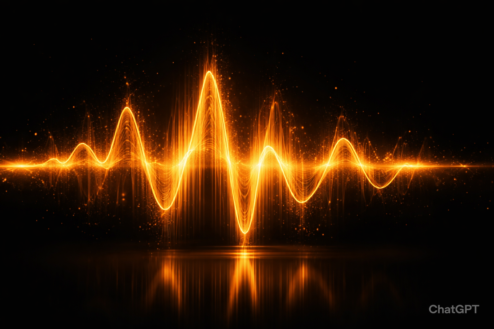{data-zoom-image}

## 1. Les propriétés du son

Le son est une vibration qui se propage dans l'air sous forme d'ondes.

### A. La fréquence

La fréquence correspond au nombre de vibrations par seconde.

Elle est mesurée en **Hertz (Hz)**.

**Exemple**

* 100 Hz = son grave
* 1000 Hz = son médium
* 10000 Hz = son aigu

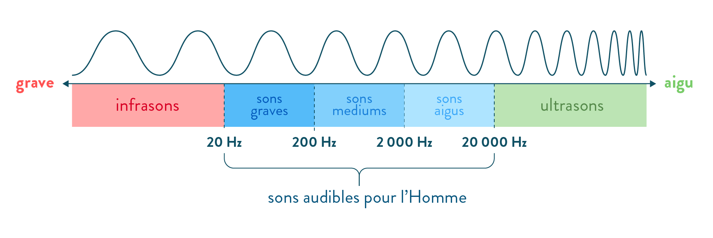{data-zoom-image}<small>Source: synthfood.fr</small>

**À retenir**

✅ Plus la fréquence est élevée, plus le son est aigu.

✅ Plus la fréquence est basse, plus le son est grave.

### B. L'amplitude

L'amplitude représente la force ou l'intensité du son.

Elle est mesurée en **décibels (dB)**.

**Exemple**

* Chuchotement : environ 30 dB
* Conversation : environ 60 dB
* Concert rock : plus de 100 dB

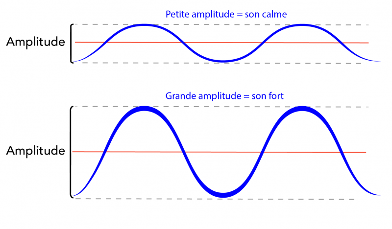{data-zoom-image}<small>Source: letstalkscience.ca</small>

**À retenir**

✅ Une grande amplitude produit un son plus fort.

✅ Une faible amplitude produit un son plus faible.

### C. La durée

La durée représente le temps pendant lequel un son est entendu.

**Exemple**

* Claquement de porte : courte durée
* Sirène : longue durée

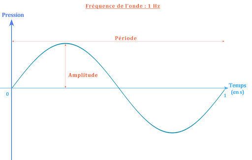{data-zoom-image}<small>Source: googleusercontent.com</small>

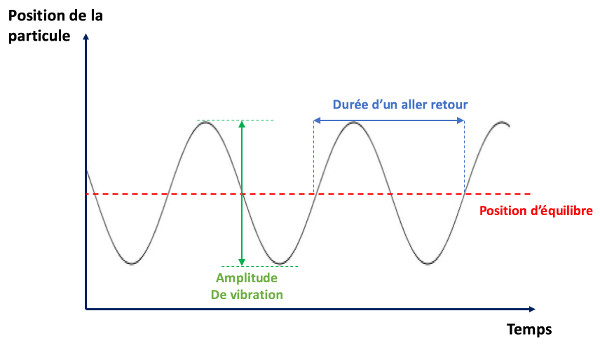{data-zoom-image}<small>Source: syos.com</small>

### D. Le timbre

Le timbre est ce qui permet de distinguer deux sons ayant la même note.

**Exemple**

Une guitare et un piano peuvent jouer la même note, mais leur timbre est différent.

Le timbre est souvent appelé la **couleur sonore**.

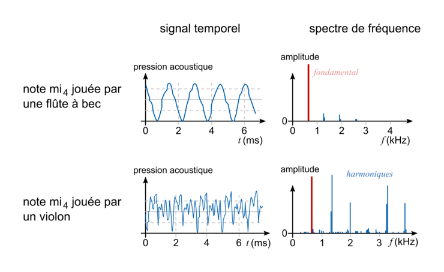{data-zoom-image}<small>Source: assistancescolaire.com</small>

## 2. La perception sonore

Notre cerveau interprète constamment les sons qui nous entourent.

Deux personnes peuvent entendre le même son et le percevoir différemment.

Cette perception dépend :

* de l'expérience personnelle ;
* du contexte ;
* de l'attention portée à l'écoute ;
* de l'environnement.

## 3. Le paysage sonore

Le paysage sonore est l'ensemble des sons présents dans un lieu.

**Exemple**

Dans un parc :

* oiseaux ;
* vent ;
* conversations ;
* circulation ;
* feuilles qui bougent.

---

##### Objet sonore

Un objet sonore est un son identifiable et distinct.

**Exemples**

* une porte qui ferme ;
* un klaxon ;
* un rire ;
* une sonnette.

---

##### Bruit de fond

Le bruit de fond est l'ensemble des sons continus qui composent l'environnement.

**Exemples**

* ventilation ;
* circulation lointaine ;
* climatiseur ;
* pluie.

## 4. Les plans sonores

Comme en photographie ou au cinéma, le son possède différents plans.

| Premier plan     | Plan intermédiaire    |  Arrière-plan    | 
| ----------- | ----------- | ----------- |
| Le son principal.    | Les sons secondaires.   |  Les sons éloignés.   | 
| <b>Exemple</b>    | <b>Exemple</b>   |  <b>Exemple</b>   | 
| Une personne qui parle devant nous. | Des gens qui discutent derrière le locuteur. | La circulation au loin. |

## 5. La promenade sonore (Sound Walk)

Une promenade sonore consiste à écouter activement son environnement.

L'objectif est de découvrir des sons qui passent habituellement inaperçus.

### Pendant la promenade

Prendre des notes sur :

| Fréquences    | Intensité   |  Position   |  Distance |   
| ----------- | ----------- | ----------- | ----------- |
| Grave  | Faible   |   Devant  |   Très proche |
| Médium   | Moyen   |  Derrière    |   Moyenne distance    |
| Aigu   | Fort  |  Gauche  |   Très éloigné    |
|       |       |   Droite  |
|       |       |   Haut  |
|       |       |   Bas  |

##### Texture sonore

Comment décririez-vous le son ?

## 6. L'enregistrement audionumérique

Aujourd'hui, le son est généralement enregistré sous forme numérique.

Le son analogique est converti en données numériques.

### Fréquence d'échantillonnage

La fréquence d'échantillonnage indique combien de fois par seconde le son est mesuré.

**Exemples**

* 44,1 kHz
* 48 kHz
* 96 kHz

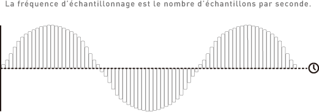{data-zoom-image}<small>Source: deveniringeson.com</small>

**À retenir**

✅ Plus la fréquence est élevée, plus la représentation du son est précise.

### Profondeur de bits (Bit Depth)

Elle détermine la précision avec laquelle l'intensité sonore est enregistrée.

**Exemples**

* 16 bits
* 24 bits
* 32 bits float

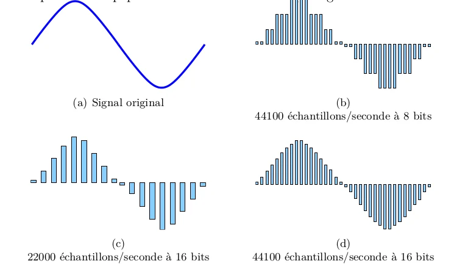{data-zoom-image}<small>Source: researchgate.net</small>

**À retenir**

✅ Une plus grande profondeur de bits offre une meilleure plage dynamique.

## 7. Le niveau d'enregistrement

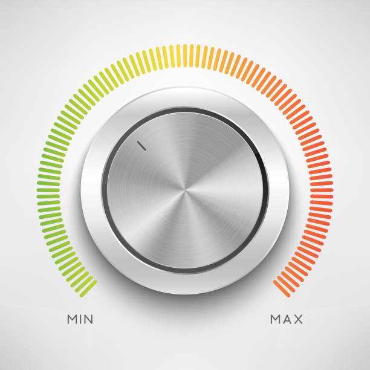{data-zoom-image}<small>Source: freepik.com</small>

Le niveau d'enregistrement doit être suffisamment élevé sans provoquer de distorsion.

### Zone verte

✅ Niveau sécuritaire

### Zone jaune

✅ Niveau acceptable

### Zone rouge

❌ Risque de distorsion

❌ Risque de perte de qualité

## 8. Le rapport signal/bruit

Le rapport signal/bruit compare :

**Signal utile ÷ Bruit indésirable**

**Exemple**

Une voix enregistrée clairement avec peu de bruit de fond possède un bon rapport signal/bruit.

**À retenir**

✅ Plus le rapport signal/bruit est élevé, meilleure est la qualité de l'enregistrement.

## 9. Les microphones

Le microphone transforme les vibrations sonores en signal électrique.

### Quelques types de microphones

##### Dynamique

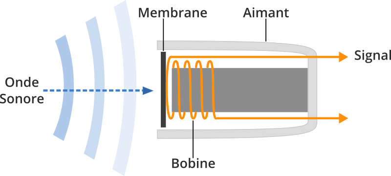{data-zoom-image}<small>Source: projethomestudio.fr</small>

Utilisé pour :

* voix sur scène ;
* batterie ;
* amplificateurs.

**Avantages :**

* robuste ;
* peu sensible.

---

##### Condensateur

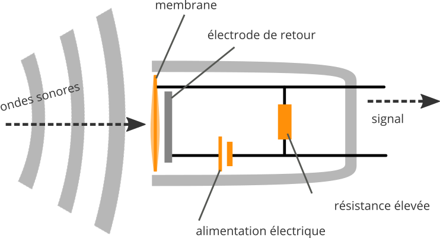{data-zoom-image}<small>Source: projethomestudio.fr</small>

Utilisé pour :

* studio ;
* voix ;
* instruments acoustiques.

**Avantages :**

* très détaillé ;
* grande sensibilité.

⚠️ Nécessite souvent une alimentation 48V.

## 10. L'alimentation fantôme (48V)

Le 48 volts sert à alimenter plusieurs microphones à condensateur.

Sans cette alimentation, certains microphones ne fonctionneront pas.

## 11. L'effet de proximité

Lorsqu'un microphone est très près de la source sonore :

✅ Les basses fréquences augmentent.

✅ Le son paraît plus chaleureux.

## 12. Distance de prise de son

### Plan rapproché

* Son détaillé
* Peu d'ambiance

### Plan moyen

* Équilibre entre source et environnement

### Plan éloigné

* Plus d'ambiance
* Moins de détails

## Préparation du TP2

Pendant votre prochaine promenade sonore :

1. Identifiez au moins cinq objets sonores.
2. Décrivez les différents plans sonores.
3. Analysez les fréquences dominantes.
4. Décrivez l'ambiance générale du lieu.
5. Utilisez le vocabulaire vu en classe.

## Résumé

À la fin de ce cours, vous devriez être capable de :

* Décrire les propriétés du son.
* Identifier les plans sonores.
* Analyser un paysage sonore.
* Comprendre les bases de l'enregistrement numérique.
* Expliquer le rapport signal/bruit.
* Reconnaître les principaux types de microphones.
* Comprendre l'effet de proximité.
* Préparer une prise de son simple.
