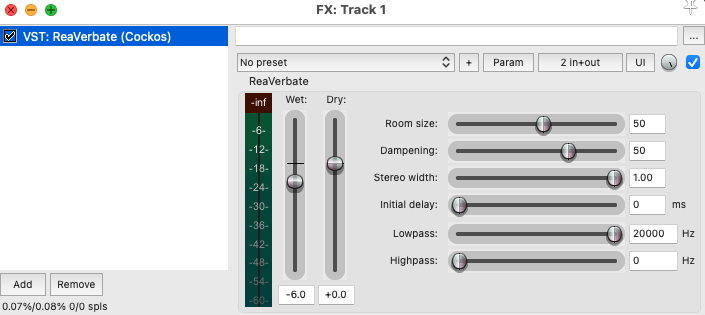

# ReaVerbate — Réverbération algorithmique

{data-zoom-image}<small>Source: reddit.com</small>

## 1. ReaVerbate

ReaVerbate est un plugin intégré à REAPER qui permet d'ajouter une **réverbération algorithmique** à un son.

Contrairement à ReaVerb, qui utilise des **réponses impulsionnelles (IR)**, ReaVerbate génère la réverbération à partir de paramètres permettant de contrôler directement les caractéristiques de l'espace.

Il peut être utilisé pour :

- simuler une pièce
- ajouter de la profondeur
- créer une ambiance
- donner une impression d'espace
- créer des effets de sound design


**2. Ajouter ReaVerbate à une piste**

Ouvrir REAPER.

Sur la piste audio, cliquer sur le bouton **FX**.

Dans la liste des plugins, chercher :

`ReaVerbate`

Double-cliquer sur ReaVerbate pour l'ajouter à la chaîne d'effets.


**3. Ajuster la taille de l'espace**

Le paramètre **Room Size** permet de contrôler la taille virtuelle de l'espace.

Une petite valeur donne l'impression d'être dans :

- une petite pièce
- une cabine
- un studio

Une valeur plus élevée peut donner l'impression d'être dans :

- une grande salle
- un auditorium
- une église
- un espace très vaste

> Plus l'espace est grand, plus la réverbération peut sembler longue et diffuse.


**4. Contrôler la durée de la réverbération**

Le paramètre **Dampening** permet de contrôler la façon dont les hautes fréquences sont absorbées dans l'espace.

Une réverbération avec beaucoup d'absorption peut sembler :

- plus douce
- plus sombre
- plus naturelle

Une réverbération avec moins d'absorption peut sembler :

- plus brillante
- plus présente
- plus artificielle

Ce paramètre est particulièrement utile pour adapter la réverbération au type d'environnement recherché.


**5. Ajuster le Wet et le Dry**

ReaVerbate permet de contrôler la quantité de son original et de son réverbéré.

**Dry** = son original

**Wet** = son traité avec la réverbération

Pour une utilisation naturelle :

- conserver une bonne quantité de Dry
- utiliser une quantité modérée de Wet

Pour un effet créatif :

- augmenter le Wet
- réduire le Dry

Par exemple :

```text
Dry = 80 %
Wet = 20 %
```

peut produire une réverbération relativement subtile.


**6. Pre-delay**

Le **Pre-delay** permet de créer un délai entre le son original et le début de la réverbération.

Par exemple :

- **0 ms** → réverbération immédiate
- **10–30 ms** → séparation légère
- **30–60 ms** → séparation plus évidente

Le Pre-delay peut permettre de conserver la clarté du son original tout en ajoutant de la profondeur.

Il est particulièrement utile pour :

- les voix
- les dialogues
- les percussions
- les effets sonores


**7. Diffusion**

La **Diffusion** contrôle la densité de la réverbération.

Une diffusion élevée produit une réverbération :

- plus dense
- plus uniforme
- plus enveloppante

Une diffusion plus faible peut produire une réverbération :

- plus distincte
- moins dense
- parfois plus artificielle

Pour un effet naturel, une diffusion élevée peut généralement donner un résultat plus réaliste.


**8. Effets créatifs**

ReaVerbate peut également être utilisé pour le **sound design**.

Par exemple :

- créer une ambiance très réverbérée
- donner l'impression qu'un son provient d'un grand espace
- créer une voix étrange
- accentuer un impact
- créer une transition
- donner un caractère irréel à un son
- créer une sensation de distance

On peut également combiner ReaVerbate avec :

- EQ
- Delay
- ReaPitch
- Compression
- Automation


**9. Utiliser ReaVerbate avec un bus**

Une technique très utilisée consiste à créer une **piste de réverbération auxiliaire**.

Créer une nouvelle piste.

Ajouter ReaVerbate sur cette piste.

Régler :

```text
Dry = 0 %
Wet = 100 %
```

Envoyer ensuite plusieurs pistes vers cette piste de réverbération.

Par exemple :

```text
Dialogue → Reverb
Pas → Reverb
Objets → Reverb
Impacts → Reverb
```

Cette technique permet à plusieurs sons de partager le même espace acoustique.

> Cela peut aider à donner une impression de cohérence entre les différents sons d'une scène.


**10. Automation**

Les paramètres de ReaVerbate peuvent être automatisés.

Clic droit sur un paramètre, par exemple :

**Wet**

Choisir :

**Show track envelope**

Dessiner ensuite une automation pour modifier la réverbération au cours du temps.

Par exemple :

```text
Son sec → Réverbération faible → Réverbération forte
```

Cette technique peut être utilisée pour créer :

- des transitions
- des effets de distance
- des changements d'ambiance
- des effets dramatiques
- des effets de sound design


**11. Conseils pratiques**

Éviter d'utiliser trop de réverbération lorsque le son doit rester clair.

Une réverbération excessive peut rendre un son :

- brouillon
- distant
- peu intelligible
- difficile à mixer

Commencer avec une petite quantité de Wet et augmenter progressivement.

**Astuce**

Essayer différentes combinaisons de **Room Size**, **Dampening**, **Pre-delay** et **Wet**.

Écouter le résultat en contexte plutôt que de juger la réverbération uniquement en solo.

Pour le sound design, ne pas hésiter à exagérer les paramètres afin d'obtenir un effet volontairement irréaliste.


**12. ReaVerbate vs ReaVerb**

Les deux plugins permettent de créer de la réverbération, mais leur fonctionnement est différent.

| ReaVerbate | ReaVerb |
|---|---|
| Réverbération algorithmique | Réverbération par convolution |
| Génère la réverbération | Utilise une IR |
| Paramètres d'espace directement contrôlables | Caractéristiques basées sur l'IR |
| Simple et rapide à configurer | Plus flexible avec différentes IR |
| Idéal pour expérimenter rapidement | Idéal pour reproduire des espaces précis |


**3. Résumé**

ReaVerbate est un outil simple et flexible pour ajouter de la **réverbération algorithmique** dans REAPER.

Il permet notamment de :

- simuler différents espaces
- contrôler la taille de la pièce
- modifier la diffusion
- contrôler l'absorption des hautes fréquences
- utiliser le Pre-delay
- ajuster le Wet et le Dry
- créer des ambiances
- créer des effets de sound design
- automatiser la réverbération


# ReaPitch dans REAPER

{data-zoom-image}<small>Source: reddit.com</small>

## 1. ReaPitch
**ReaPitch** est un plugin intégré à REAPER qui permet de modifier la hauteur (pitch) d’un son, de créer des harmonies, ou encore des effets de transformation vocale et sonore.


**2. Ajouter ReaPitch à une piste**
1. Ouvrir REAPER.
2. Sur la piste audio, cliquer sur le bouton **FX**.
3. Dans la liste des plugins, chercher **ReaPitch**.
4. Double-cliquer pour l’ajouter à la chaîne d’effets.


 **3. Modifier la hauteur d’un son**
- Dans ReaPitch, repérer la section **Shift** ou **Pitch Shift**.
- Ajuster la valeur en **semitones (demi-tons)** :
  - +12 = une octave plus aiguë
  - -12 = une octave plus grave
- Utiliser de petites valeurs (+/- 1 à 5) pour des ajustements naturels.

**4. Créer des harmonies**
1. Dans ReaPitch, ajouter une nouvelle voix (Harmony / Voice).
2. Définir le décalage de pitch pour chaque voix :
   - Exemple :
     - +3 demi-tons (tierce mineure)
     - +7 demi-tons (quinte)
3. Ajuster le **mix (wet/dry)** pour équilibrer le son original et les harmonies.


**5. Utiliser le mode formant**
- Activer **Formant shift** pour préserver ou transformer le timbre.
- Utile pour :
  - éviter l’effet “chipmunk”
  - créer des voix plus naturelles ou très artificielles


**6. Effets créatifs**
ReaPitch peut être utilisé pour :
- Voix robotisées
- Effets de chute ou montée extrême (pitch automation)
- Sound design expérimental
- Transformation d’instruments


**7. Automation (option avancée)**
1. Clic droit sur un paramètre (ex. Pitch).
2. Choisir **Show track envelope**.
3. Dessiner une automation pour faire varier le pitch dans le temps.


**8. Conseils pratiques**
- Tester plusieurs voix pour créer des textures riches.
- Combiner ReaPitch avec reverb ou delay pour des effets plus larges.


**9. Résumé**
ReaPitch est un outil simple mais puissant pour transformer la hauteur des sons, créer des harmonies et explorer le sound design dans REAPER.


## Les Motifs

<div class="grid grid-1-2" markdown>
  

  <small>Motif</small><br>
  **[Balancement](./exercices/balancement.md){.stretched-link .back}**
</div>

<div class="grid grid-1-2" markdown>
  

  <small>Motif</small><br>
  **[Miroir](./exercices/miroir.md){.stretched-link .back}**
</div>

<div class="grid grid-1-2" markdown>
  

  <small>Motif</small><br>
  **[Spirale](./exercices/spirale.md){.stretched-link .back}**
</div>

<div class="grid grid-1-2" markdown>
  

  <small>Motif</small><br>
  **[Time Stretch](./exercices/etirement-temporel.md){.stretched-link .back}**
</div>

<div class="grid grid-1-2" markdown>
  

  <small>Motif</small><br>
  **[Ping-Pong](./exercices/ping-pong.md){.stretched-link .back}**
</div>

<div class="grid grid-1-2" markdown>
  

  <small>Motif</small><br>
  **[Rebondissement](./exercices/rebondissement.md){.stretched-link .back}**
</div>

<div class="grid grid-1-2" markdown>
  

  <small>Motif</small><br>
  **[Flexion](./exercices/flexion.md){.stretched-link .back}**
</div>

<div class="grid grid-1-2" markdown>
  

  <small>Motif</small><br>
  **[Inversion](./exercices/inversion.md){.stretched-link .back}**
</div>

<div class="grid grid-1-2" markdown>
  

  <small>Motif</small><br>
  **[VITESSE DE LECTURE](./exercices/vitesse.md){.stretched-link .back}**
</div>

<div class="grid grid-1-2" markdown>
  

  <small>Motif</small><br>
  **[Percussion et Résonnance](./exercices/percussion-resonnance.md){.stretched-link .back}**
</div>


## Projet B – Continuer la réduction d’entrevue

<div class="grid grid-1-2" markdown>
  

  <small>Réduction d’entrevue</small><br>
  **[Projet B](./examens/projet-b.md){.stretched-link .back}**
</div>