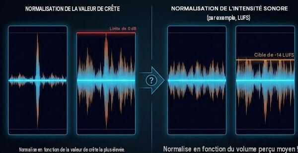

# Types de compression selon le média de diffusion

{data-zoom-image}<small>Source: futurelearn.com</small>

La **compression audio** ne se fait pas nécessairement de la même façon selon le média sur lequel le son sera diffusé.

Un fichier destiné à un **film**, à un **jeu vidéo**, à une **plateforme de diffusion en continu** ou à un **réseau social** peut avoir des exigences différentes en matière de :

- dynamique
- niveau sonore
- format
- débit
- fréquence d'échantillonnage
- résolution
- volume final

L'objectif est toujours de trouver un équilibre entre **qualité sonore, dynamique et compatibilité avec le média de diffusion**.


## 1. Compression selon le média de diffusion

### Pourquoi adapter la compression ?

Tous les systèmes de diffusion ne reproduisent pas le son de la même manière.

Par exemple, une bande sonore de film peut conserver une **grande plage dynamique**, alors qu'un contenu destiné aux réseaux sociaux peut être davantage contrôlé afin que les dialogues et les effets restent audibles sur des écouteurs ou de petits haut-parleurs.

Il faut donc distinguer deux notions :

**Compression dynamique**  
→ réduit les différences entre les sons faibles et les sons forts.

**Compression de données**  
→ réduit la taille du fichier audio, par exemple avec MP3 ou AAC.

Ces deux types de compression sont complètement différents.

---

#### 2. Vidéo

Pour une production vidéo ou télévisuelle, on cherche généralement à conserver une dynamique relativement naturelle tout en évitant les niveaux excessifs.

La priorité est souvent :

- conserver l'intelligibilité des dialogues
- maintenir une dynamique cohérente
- éviter la saturation
- respecter les normes de niveau sonore du diffuseur

**Exemple**

Une scène peut contenir :

```text
Dialogue → niveau modéré
Ambiance → faible
Explosion → très forte
```

Si on compresse excessivement la piste, l'explosion risque de perdre son impact.

**Pour le cinéma et la vidéo narrative, la dynamique fait partie de l'expérience.**

---

#### 3. Musique

La musique demande généralement un contrôle plus important de la dynamique, particulièrement pour les productions destinées à la diffusion numérique.

On peut utiliser :

- compression
- EQ
- limiteur
- automation
- maximisation

L'objectif n'est pas nécessairement d'avoir le son le plus fort possible.

Il faut plutôt obtenir un niveau suffisamment élevé tout en conservant :

- les transitoires
- la dynamique
- la clarté
- l'impact

**Exemple**

Une batterie très dynamique peut avoir :

```text
Coup faible → -18 dB
Coup fort → -6 dB
```

La compression peut réduire cet écart afin de rendre le niveau plus constant.

---

#### 4. Streaming et plateformes numériques

Les plateformes de diffusion comme YouTube, Spotify et Apple Music utilisent leurs propres systèmes de gestion du niveau sonore.

Une production trop forte peut donc être **réduite automatiquement** lors de la lecture.

Cela signifie qu'il n'est plus toujours avantageux de chercher à rendre un fichier extrêmement fort.

##### Principe important

> **Plus fort ne signifie pas nécessairement meilleur.**

Une bonne préparation doit conserver suffisamment de dynamique et éviter la distorsion.

---

#### 5. Jeux vidéo

Dans un jeu vidéo, la dynamique doit fonctionner dans des situations très différentes.

Le joueur peut utiliser :

- des écouteurs
- un casque
- des haut-parleurs de télévision
- un système de cinéma maison

Les sons doivent donc rester suffisamment audibles sans devenir agressifs.

La compression peut être utilisée pour :

- contrôler les explosions
- rendre les effets plus constants
- maintenir les dialogues audibles
- éviter des écarts de volume trop importants

Cependant, une compression excessive peut enlever de l'impact aux effets.

---

#### 6. Réseaux sociaux et contenu mobile

Les vidéos destinées aux réseaux sociaux sont souvent écoutées dans des environnements bruyants et sur de petits systèmes de reproduction.

On retrouve souvent :

- téléphone
- écouteurs
- petits haut-parleurs
- écoute à faible volume

Dans ce contexte, il est important que :

- la voix reste intelligible
- le niveau soit relativement constant
- les éléments importants ressortent rapidement

Une compression dynamique plus importante peut donc être pertinente.

---

#### 7. Contrôle de la plage dynamique

La **plage dynamique** correspond à la différence entre les sons les plus faibles et les sons les plus forts d'une production.

Par exemple :

```text
Son faible          Son fort
   ↓                   ↓
 -40 dB              -3 dB
       ← dynamique →
```

Une grande plage dynamique signifie qu'il existe une grande différence entre les sons faibles et les sons forts.

Une petite plage dynamique signifie que les niveaux sont plus rapprochés.

## La compression dynamique

{data-zoom-image} 
<small>Source: easyzic.com</small>

Le compresseur réduit automatiquement le niveau lorsque le signal dépasse un certain seuil.

Exemple :

```text
Avant compression :

Faible ──────────────── Fort
-30 dB                  -3 dB


Après compression :

Faible ────────── Fort
-30 dB             -10 dB
```

Le son fort est rapproché du son faible.

---

## Normalisation des fichiers

{data-zoom-image} 
<small>Source: ampedstudio.com</small>

La **normalisation** consiste à ajuster le niveau général d'un fichier audio selon une référence.

Il existe différentes façons de normaliser.

### Normalisation au peak

{data-zoom-image} 
<small>Source: ampedstudio.com</small>

On ajuste le fichier en fonction de son niveau de crête.

Exemple :

```text
Peak original : -4 dBFS
Peak désiré   : -1 dBFS
```

On augmente alors le niveau général de **3 dB**.

### Limite

La normalisation au peak ne tient pas nécessairement compte de la façon dont l'oreille perçoit le volume.

Deux fichiers peuvent avoir exactement le même peak à **-1 dBFS** et sembler avoir des volumes très différents.

---

### Amplitude moyenne et perception du volume

Pour mieux représenter le volume perçu, on utilise des mesures comme :

- **RMS**
- **LUFS**

Le **RMS** donne une indication de l'énergie moyenne du signal.

Les **LUFS** sont particulièrement utilisés pour mesurer le niveau sonore perçu d'une production.

On peut donc avoir :

```text
Fichier A
Peak : -1 dBFS
Niveau moyen : faible

Fichier B
Peak : -1 dBFS
Niveau moyen : élevé
```

Les deux fichiers ont le même niveau de crête, mais **le fichier B semblera beaucoup plus fort**.

---

### Volume final de l'exportation

Le niveau final d'une production doit être contrôlé avant l'exportation.

Il faut vérifier :

- le niveau de crête
- le niveau moyen
- les LUFS
- les éventuelles saturations
- la dynamique
- la compatibilité avec le média de diffusion

**Attention au limiteur**

Un limiteur placé sur le master peut empêcher le signal de dépasser un niveau déterminé.

Par exemple :

```text
Limiter
Ceiling = -1 dB
```

Le limiteur empêche le signal de dépasser cette valeur.

Mais pousser trop fortement le limiteur peut entraîner :

- perte de dynamique
- distorsion
- pompage
- fatigue auditive
- perte d'impact


**Exemple concret**

Imaginons une scène de film comprenant :

- dialogue
- pas
- ambiance
- porte
- explosion

Sans contrôle dynamique :

```text
Dialogue       -20 dB
Pas             -25 dB
Ambiance        -30 dB
Porte           -12 dB
Explosion        -2 dB
```

L'écart entre le dialogue et l'explosion est très important.

On peut utiliser de la compression et de l'automation pour contrôler certains éléments tout en conservant l'impact de l'explosion.

L'objectif n'est donc **pas de mettre tous les sons au même niveau**.

L'objectif est de contrôler la dynamique afin que chaque élément fonctionne dans le contexte de la production.


#### Compression et normalisation : ne pas confondre

| Compression dynamique | Normalisation |
|---|---|
| Modifie la dynamique | Modifie principalement le niveau général |
| Réduit les écarts entre faible et fort | Déplace le niveau du fichier |
| Peut modifier le caractère du son | Ne modifie normalement pas la dynamique |
| Utilise seuil, ratio, attaque, release | Utilise une valeur cible |
| Peut créer un effet sonore | Sert principalement à ajuster le niveau |

**Exemple**

**Normalisation :**

```text
Avant : -10 à -3 dB
Après : -8 à -1 dB
```

Tout le signal est simplement augmenté.

**Compression :**

```text
Avant : -30 à -3 dB
Après : -25 à -10 dB
```

Les niveaux forts ont été réduits par rapport aux niveaux faibles.

---

**À retenir**

> **La compression dynamique sert à contrôler les écarts de niveau.**

> **La normalisation sert à ajuster le niveau général d'un fichier.**

> **Le niveau moyen influence fortement la perception du volume.**

> **Le média de diffusion détermine en partie la quantité de contrôle dynamique nécessaire.**

Une bonne production audio ne cherche donc pas simplement à être **la plus forte possible**.

Elle doit être :

- suffisamment forte
- suffisamment dynamique
- intelligible
- sans distorsion
- adaptée au média de diffusion
- cohérente avec les autres productions du même type.

Oui. Je te suggère de faire **2 exercices différents par motif**, avec une progression **Exercice A = technique de base** et **Exercice B = application créative**. Ça donne 20 exercices au total.

---

## Exercices — Création de motifs sonores dans REAPER

### Consignes générales

Pour chaque exercice :

- Trouver un **son**.
- Travailler dans REAPER.
- Conserver le son original.
- Créer une version transformée.
- Ajuster les paramètres manuellement.
- Éviter les presets lorsque c'est possible.
- Exporter le résultat en **WAV**.
- Écouter le résultat avec un casque ou des écouteurs.


## 1. Balancement

<div class="grid grid-1-2" markdown>
  

  <small>Motif</small><br>
  **[Balancement](./exercices/balancement.md){.stretched-link .back}**
</div>

### Exercice 1A — Gauche / droite

**Objectif**

Créer un mouvement régulier du son entre la gauche et la droite.

**Consignes**

1. Importer le son dans REAPER.
2. Ajouter une automation du **Pan**.
3. Faire circuler le son :

```text
Gauche → Centre → Droite → Centre → Gauche
```

4. Répéter le mouvement pendant toute la durée du son.
5. Faire des transitions fluides.

**Défi**

Le mouvement doit être régulier et donner l'impression que le son se déplace réellement dans l'espace.

---


### Exercice 1B — Balancement irrégulier

**Objectif**

Créer un mouvement stéréo plus organique et imprévisible.

**Consignes**

Créer une automation différente :

```text
Gauche → Droite → Centre → Gauche → 70 % droite → 30 % gauche
```

Modifier également la vitesse des déplacements.

**Défi**

Le mouvement ne doit pas suivre un rythme parfaitement régulier.

**Résultat recherché**

Créer l'impression d'un son qui **tourne ou se déplace de façon imprévisible autour de l'auditeur**.


## 2. Miroir

<div class="grid grid-1-2" markdown>
  

  <small>Motif</small><br>
  **[Miroir](./exercices/miroir.md){.stretched-link .back}**
</div>

### Exercice 2A — Original / miroir

**Objectif**

Créer une deuxième partie qui est le miroir de la première.

**Consignes**

1. Importer un son.
2. Couper le son en deux.
3. Conserver la première partie.
4. Copier cette partie.
5. Utiliser **Reverse** sur la copie.
6. Placer la copie après l'original.

```text
Original → Inversé
```
**Défi**

Créer une transition suffisamment fluide entre les deux parties.

---

### Exercice 2B — Miroir stéréo

#### Objectif

Combiner inversion temporelle et déplacement stéréo.

**Consignes**

Créer :

```text
Partie A
↓
Pan gauche
↓
Reverse
↓
Pan droite
```

La deuxième partie doit être le miroir temporel et spatial de la première.

**Résultat recherché**

Donner l'impression que le son est **réfléchi dans un espace sonore**.


## 3. Spirale

<div class="grid grid-1-2" markdown>
  

  <small>Motif</small><br>
  **[Spirale](./exercices/spirale.md){.stretched-link .back}**
</div>

### Exercice 3A — Spirale de pitch

**Objectif**

Créer une montée ou une descente progressive du pitch.

**Consignes**

Utiliser **ReaPitch** et automatiser le pitch.

Exemple :

```text
0 → +3 → +7 → +12 → +7 → +3 → 0
```

**Résultat recherché**

Le son doit donner l'impression de **tourner autour d'une hauteur centrale**.

---

### Exercice 3B — Spirale complète

**Objectif**

Combiner plusieurs paramètres.

Utiliser au minimum :

- Pitch
- Pan
- Reverb

Faire évoluer les paramètres simultanément.

Exemple :

```text
Pitch ↑
Pan gauche → droite
Reverb ↑
Volume ↓
```

**Résultat recherché**

Créer un son qui semble **s'éloigner dans une spirale**.


## 4. Time Stretch

<div class="grid grid-1-2" markdown>
  

  <small>Motif</small><br>
  **[Time Stretch](./exercices/etirement-temporel.md){.stretched-link .back}**
</div>

### Exercice 4A — Ralentissement

**Objectif**

Découvrir la transformation temporelle.

**Consignes**

Créer trois versions du même son :

```text
100 %
200 %
400 %
```

Comparer les résultats.

**Questions**

- Le son reste-t-il reconnaissable ?
- Qu'est-ce qui change dans sa texture ?
- Quels artefacts apparaissent ?

---

### Exercice 4B — Transformation extrême

**Objectif**

Utiliser le Time Stretch comme outil de sound design.

**Consignes**

Créer une version extrêmement ralentie du son.

Essayer d'obtenir un résultat **au moins quatre fois plus long** que l'original.

Ajouter ensuite :

- Reverb
- EQ ou ReaEQ
- éventuellement ReaPitch

**Résultat recherché**

Transformer un son ordinaire en **texture sonore**.


## 5. Ping-Pong

<div class="grid grid-1-2" markdown>
  

  <small>Motif</small><br>
  **[Ping-Pong](./exercices/ping-pong.md){.stretched-link .back}**
</div>

### Exercice 5A — Delay ping-pong

**Objectif**

Créer un écho qui se déplace alternativement entre les deux côtés.

**Consignes**

Utiliser un **Delay** avec déplacement stéréo.

```text
Original → Gauche
Echo 1 → Droite
Echo 2 → Gauche
Echo 3 → Droite
```

**Défi**

Faire diminuer progressivement les répétitions.

---

### Exercice 5B — Ping-pong rythmique

**Objectif**

Créer un motif rythmique avec le ping-pong.

**Consignes**

Créer plusieurs répétitions du son selon un rythme.

Exemple :

```text
G  .  D  .  G  D  .  G
```

Modifier :

- délai
- volume
- pan
- feedback

**Résultat recherché**

Créer un motif qui pourrait être intégré à une musique ou à un design sonore.

## 6. Rebondissement

<div class="grid grid-1-2" markdown>
  

  <small>Motif</small><br>
  **[Rebondissement](./exercices/rebondissement.md){.stretched-link .back}**
</div>

### Exercice 6A — Objet qui tombe
**Objectif**

Créer l'illusion d'un objet qui tombe et rebondit.

**Consignes**

Créer plusieurs copies du son.

À chaque rebond :

- diminuer le volume
- raccourcir le son
- modifier légèrement le pitch

```text
Impact
↓
Rebond
↓
Rebond
↓
Rebond
```

**Résultat recherché**

L'auditeur doit pouvoir imaginer un **objet physique**.

---

### Exercice 6B — Rebondissement spatial

**Objectif**

Ajouter une dimension spatiale au rebondissement.

**Consignes**

En plus du volume et du pitch, automatiser le **Pan**.

Exemple :

```text
Impact → Centre
Rebond 1 → Gauche
Rebond 2 → Droite
Rebond 3 → Gauche
```

Ajouter éventuellement une petite reverb.

**Résultat recherché**

Créer l'impression que l'objet **rebondit dans un espace réel**.


## 7. Flexion

<div class="grid grid-1-2" markdown>
  

  <small>Motif</small><br>
  **[Flexion](./exercices/flexion.md){.stretched-link .back}**
</div>

### Exercice 7A — Pitch Bend

**Objectif**

Créer une flexion de la hauteur.

**Consignes**

Utiliser **ReaPitch**.

Automatiser le pitch :

```text
0 → +12 → 0
```

Puis :

```text
0 → -12 → 0
```

**Résultat recherché**

Créer une montée et une descente de hauteur clairement perceptibles.

---

### Exercice 7B — Flexion extrême

**Objectif**

Créer un effet de sound design à partir du pitch.

**Consignes**

Créer une automation plus complexe :

```text
0 → +12 → +5 → -7 → -12 → 0
```

Ajouter éventuellement :

- Reverb
- Delay
- Automation de volume

**Résultat recherché**

Créer un son qui semble **se tordre ou se déformer**.


## 8. Inversion

<div class="grid grid-1-2" markdown>
  

  <small>Motif</small><br>
  **[Inversion](./exercices/inversion.md){.stretched-link .back}**
</div>

### Exercice 8A — Son inversé

**Objectif**

Découvrir l'effet **Reverse**.

**Consignes**

1. Importer le son.
2. Dupliquer le fichier.
3. Inverser la copie.
4. Comparer avec l'original.

Identifier ce qui change dans :

- l'attaque
- la décroissance
- la texture
- la perception du son.

---

### Exercice 8B — Transition inversée

**Objectif**

Créer une transition sonore.

**Consignes**

Utiliser un son inversé pour **préparer l'arrivée d'un son original**.

```text
Son inversé
     ↓
     ↓
     ↓
Impact original
```

Ajouter éventuellement :

- Reverb
- Delay
- Fade-in

**Résultat recherché**

Créer un effet de **montée ou d'aspiration vers l'impact**.


## 9. Vitesse de lecture

<div class="grid grid-1-2" markdown>
  

  <small>Motif</small><br>
  **[VITESSE DE LECTURE](./exercices/vitesse.md){.stretched-link .back}**
</div>

###Exercice 9A — Rapide / lent

**Objectif**

Observer l'effet de la vitesse de lecture sur un son.

**Consignes**

Créer quatre versions :

```text
50 %
75 %
100 %
200 %
```

Comparer les résultats.

**Questions**

- Le pitch change-t-il ?
- Le caractère du son change-t-il ?
- Le son devient-il plus court ou plus long ?

---

### Exercice 9B — Accélération progressive

**Objectif**

Créer un son dont la vitesse augmente progressivement.

**Consignes**

Créer plusieurs segments :

```text
Lent → Moyen → Rapide → Très rapide
```

Utiliser des changements de vitesse progressifs.

**Résultat recherché**

Créer une sensation d'**accélération**.


## 10. Percussion et résonance

<div class="grid grid-1-2" markdown>
  

  <small>Motif</small><br>
  **[Percussion et Résonnance](./exercices/percussion-resonnance.md){.stretched-link .back}**
</div>

### Exercice 10A — Transformer un son en percussion

**Objectif**

Créer une percussion à partir d'un son qui n'est pas une percussion.

**Consignes**

1. Choisir un son.
2. En extraire une petite portion.
3. La répéter selon un rythme.
4. Ajuster le volume.
5. Utiliser éventuellement un EQ et un compresseur.

Exemple :

```text
X . X . X X . X
```

**Résultat recherché**

Le son doit devenir une **nouvelle percussion**.

---

### Exercice 10B — Percussion résonnante

**Objectif**

Créer une percussion avec une longue résonance.

**Consignes**

Créer une percussion puis lui ajouter :

- ReaVerbate ou ReaVerb
- ReaPitch
- EQ

Expérimenter avec la durée de la réverbération.

**Défi**

Créer trois versions :

```text
Petite pièce
Grande salle
Espace irréel
```

**Résultat recherché**

Faire entendre clairement la différence entre les trois espaces.


## Projet final — Création d'un motif sonore

Après les 20 exercices, demander aux étudiants de créer un **motif sonore original de 15 à 30 secondes**.

**Contraintes**

Le projet doit utiliser au minimum :

- **3 motifs différents**
- **1 automation**
- **1 traitement temporel**
- **1 traitement spatial**
- **1 traitement de hauteur ou de timbre**

Exemple :

```text
Son source
    ↓
Time Stretch
    ↓
ReaPitch
    ↓
Balancement
    ↓
Delay Ping-Pong
    ↓
ReaVerbate
    ↓
Automation
    ↓
Motif sonore final
```

**Objectif**

Créer un son qui pourrait être utilisé dans :

- un film
- un jeu vidéo
- une animation
- une publicité
- une installation multimédia

