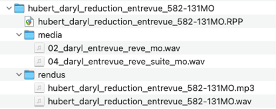

# Projet B - Réduction d’entrevue

{data-zoom-image}<small>Source: https://www.theguardian.com/</small>

- Travail individuel | Fichier audionumérique (.wav et .mp3) avec dossier de travail 

- Date de remise : Cours 8 (avant le cours) 

### OBJECTIFS D’APPRENTISSAGE 

Réaliser un montage sonore de qualité. 

### TÂCHE 

Vous devez réduire un enregistrement audio présentant un rêve, et faire un montage sonore professionnel. 

Vous devrez : 

- Extraire les éléments jugés essentiels et réduire l’enregistrement de votre rêve (Projet A) pour en faire un montage fluide et professionnel.  

- L’enregistrement initiale doit être d’une durée minimale de 2 minutes. 

**Durée exacte du montage final : 30 secondes.** 

### CONSIGNES  

Le montage doit être exactement de **30 secondes**. 

Il s’agit d’une réduction d’entrevue où l’on vous entend présenter votre rêve. 

Le montage est « pur ». Il doit contenir des sons provenant uniquement de l’enregistrement en limitant au maximum le bruit de fond en arrière-plan (enregistrement en studio très recommandé).  

Aucun paysage sonore en arrière-plan. 

### REMISE 

Un dossier de travail bien identifié au nom de l’étudiante ou de l’étudiant doit être remis sur le **TEAMS** avant le début du cours dans la section 

- Fichiers –> « remises ».

!!! tip "Remise"

    [nom famille]_[prénom]_reduction_entrevue_582-131MO  

Le dossier principal doit inclure : 

- Le fichier Reaper et les fichiers audios sources. 

- Les exportations finales bien identifiées et aux formats suivants : 

  - **.wav (24 bits, 48 kHz, stéréo)** : 
    ```
    [nomFamille]_[prénom]_reduction_entrevue_582-131MO.wav 
    ```


  - **.mp3 (128kbit/s)** : 
    ```
    [nomFamille]_[prénom]_reduction_entrevue_582-131MO.mp3 
    ```


Structure du dossier de remise : 

{data-zoom-image}<small>Source: reaper.fm</small>

### CRITÈRES D’ÉVALUATION 

- Organisation des pistes adéquate dans le logiciel ; 
- Exécutions techniques du montage précises, méticuleuses et achevées ; 
- Respect des consignes. 

## Grille d'évaluation

| Critère | Excellent | Bien | À améliorer | Insuffisant |
|----------|-----------|------|-------------|-------------|
| **1. Organisation des pistes** | Organisation des pistes et identification adéquates. | Organisation des pistes et identification adéquates ou nécessitant des ajustements mineurs. | Organisation des pistes et identification un peu confuses ou nécessitant des ajustements majeurs. | Organisation des pistes et identification confuses pouvant être problématiques pour le montage. |
| **2. Exécution technique : coupes et transitions** | Travail méticuleux. L'ensemble des coupes et transitions est précis et achevé. | Travail assez méticuleux. La majorité des coupes et transitions est précise et achevée. | Travail plus ou moins méticuleux. Quelques coupes et transitions sont précises et achevées. | Les coupes et transitions dans leur ensemble semblent inachevées. |
| **3. Respect des consignes** | Durée précise de 30 secondes.<br><br>Exportations audio aux bons formats : 48 kHz, WAV, 24 bits, stéréo et MP3 128 kbit/s. | Durée assez précise (moins de 5 secondes d'écart).<br><br>Au moins une exportation audio au bon format. | Durée peu précise (moins de 15 secondes d'écart).<br><br>Exportations audio aux mauvais formats. | Durée imprécise (plus de 15 secondes d'écart).<br><br>Aucune exportation audio. |

| Pénalité | Vérification |
|-----------|-------------|
| Dossier et exportations audio correctement identifiés selon la nomenclature : **[nomFamille]_[prénom]_montage_582-344MO** | ☐ |
| Enregistrement initial du rêve d'une durée minimale de 2 minutes | ☐ |
| Aucun bruit de fond important dans l'enregistrement initial | ☐ |
| Aucun paysage sonore en arrière-plan dans l'enregistrement initial | ☐ |
| Si l'enregistrement initial est non conforme, reprise obligatoire de l'enregistrement et du montage | ☐ |
| **Pénalités appliquées :** | _____________________________________ |