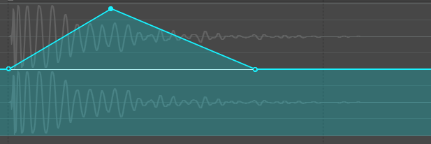
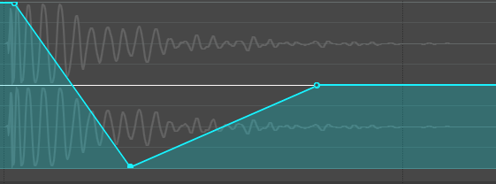
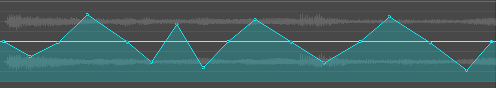
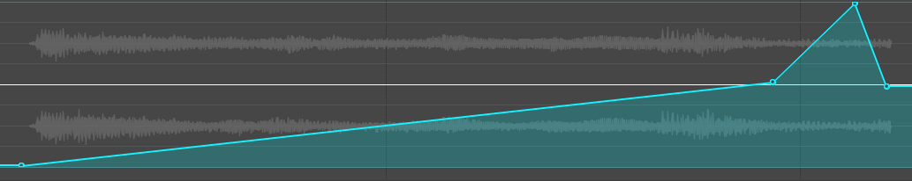
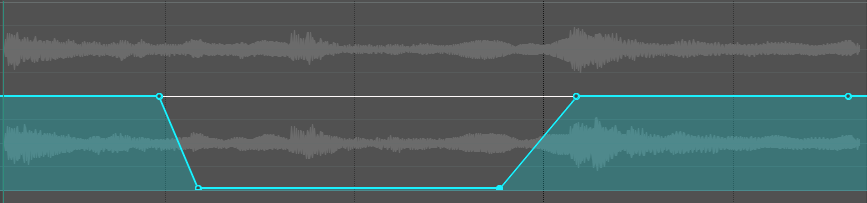

# MOTIF DE FLEXION

### Introduction

Le **motif de flexion** est une technique de design sonore qui consiste à modifier temporairement la hauteur (pitch) d’un son à l’aide d’un effet de type **Pitch Shifter**.

Cette modification est contrôlée par une **automatisation (enveloppe)** afin de créer des mouvements progressifs ou rapides dans le temps.

👉 On “plie” littéralement la hauteur du son :
- vers le haut → son plus aigu
- vers le bas → son plus grave


## Concept de base

Le principe repose sur trois éléments :

- Un son source (audio)
- Un effet **Pitch Shifter**
- Une **enveloppe d’automatisation**

### Schéma simple
```
Son audio → Pitch Shifter → Automatisation → Résultat modifié
```


## Effet 1 – Flexion ascendante (BOING)


{data-zoom-image}

### Objectif

Créer un effet de rebond (type cartoon ou interface).

### Son recommandé

- percussion
- clic
- impact court

### Procédure

1. Importer un son court
2. Ajouter un **Pitch Shifter**
3. Créer une enveloppe de pitch
4. Départ : valeur normale 
5. Monter rapidement vers les aigus à l'aide de **Shift (Full range)**
6. Revenir à la valeur normale

### Résultat

Un son qui “rebondit” vers le haut.


## Effet 2 – Flexion descendante (LASER / KICK)


{data-zoom-image}

### Objectif

Créer une chute rapide de hauteur sonore.

### Son recommandé

- kick
- impact
- bruit synthétique

### Procédure

1. Ajouter un son percussif
2. Pitch Shifter
3. Commencer avec une hauteur élevée
4. Descendre rapidement vers les graves
5. Revenir à la normale

### Résultat

Effet de chute ou de tir laser.


## Effet 3 – Tape Warble (lecteur brisé)


{data-zoom-image}

### Objectif

Simuler un lecteur cassette instable.

### Son recommandé

- voix
- musique
- ambiance

### Procédure

1. Importer un son
2. Ajouter Pitch Shifter
3. Créer des variations irrégulières
4. Alterner haut / bas de façon aléatoire à l'aide de **Shift (Full range)**
5. Finir à la valeur normale 

### Résultat

Effet instable, analogique, rétro.


## Effet 4 – Riser (transition ascendante)


{data-zoom-image}


### Objectif

Créer une montée de tension.

### Son recommandé

- drone
- bruit blanc
- synthé soutenu

### Procédure

1. Ajouter un son long
2. Pitch Shifter
3. Monter progressivement la hauteur
4. Accélérer vers la fin
5. Revenir à la normale

### Résultat

Montée de tension progressive.


## Effet 5 – Voix démoniaque


{data-zoom-image}

### Objectif

Transformer une voix en version grave et menaçante.

### Son recommandé

- voix claire et articulée

### Procédure

1. Importer la voix
2. Ajouter Pitch Shifter
3. Descendre à :

```
-12 semitons (1 octave)
```

4. Ajuster si nécessaire

### Résultat

Voix grave, sombre et dramatique.


## Effet 6 – Tape Stop


{data-zoom-image}

### Objectif

Simuler un arrêt de bande magnétique.

### Son recommandé

- musique
- boucle audio

### Procédure

1. Ajouter un son musical
2. Pitch Shifter
3. Descendre progressivement jusqu’à :
```
-24 semitons
```

4. Couper le son à la fin


## Tape Start

### Objectif

Simuler un démarrage progressif.


### Procédure

1. Commencer à basse hauteur
2. Pitch à :
```
-24 semitons
```

3. Monter jusqu’à la hauteur normale

### Résultat

Le son accélère progressivement.


