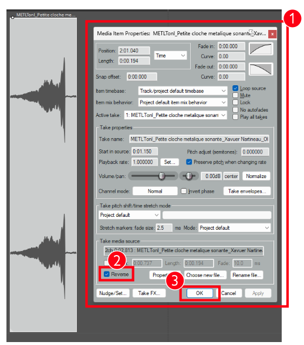
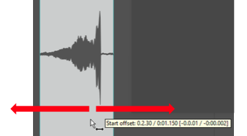

# INVERSION (« REVERSE »)

## Inversion long

## Inversion percussif

{data-zoom-image}

{data-zoom-image} 

{data-zoom-image}

<small>Source: Thomas Ouellet Fredericks</small>

### 1. Inverser un Media Item
- Ouvrir les propriétés du Media Item.
- Activer l’option d’inversion de lecture (« Reverse ») pour lire le son à l’envers.

## 2. Problème possible avec l’inversion
- Lorsque le fichier source est long et contient plusieurs sons, l’inversion peut faire perdre le son ciblé.
- Le point de lecture étant inversé, on peut ne plus retrouver la section désirée.
- Plusieurs solutions existent pour corriger ce problème.

## 3. Solution 1 : Naviguer dans la source du Media Item
- Si le son est perdu après inversion, il est possible de le retrouver en parcourant la source audio.
- Maintenir **Alt** et faire glisser le Media Item de gauche à droite pour naviguer dans le fichier.

## 4. Solution 2 : Exporter avant d’inverser
### A. Exportation
- Exporter le Media Item avant inversion :
  - `File > Render > Source : Selected Media Item`
- Sauvegarder dans le dossier de médias.

### B. Réimportation
- Importer le fichier exporté.
- Appliquer ensuite l’inversion.
- Le son ne sera plus perdu, car le fichier ne contient que le segment découpé.