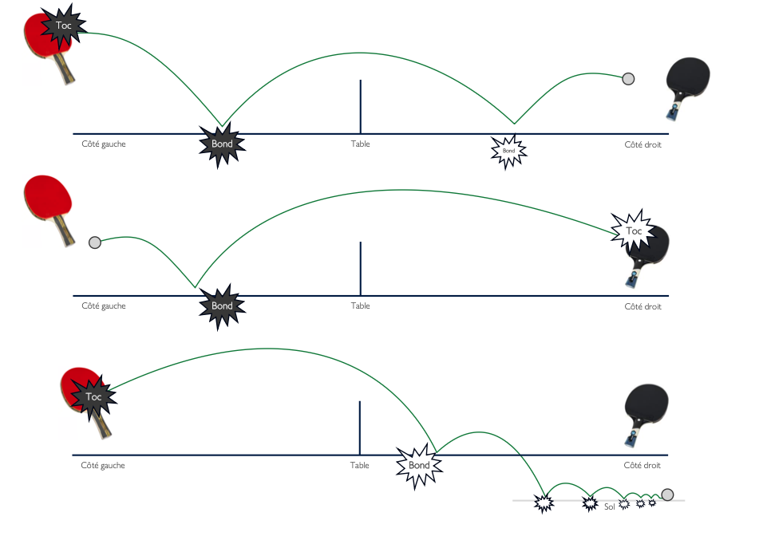
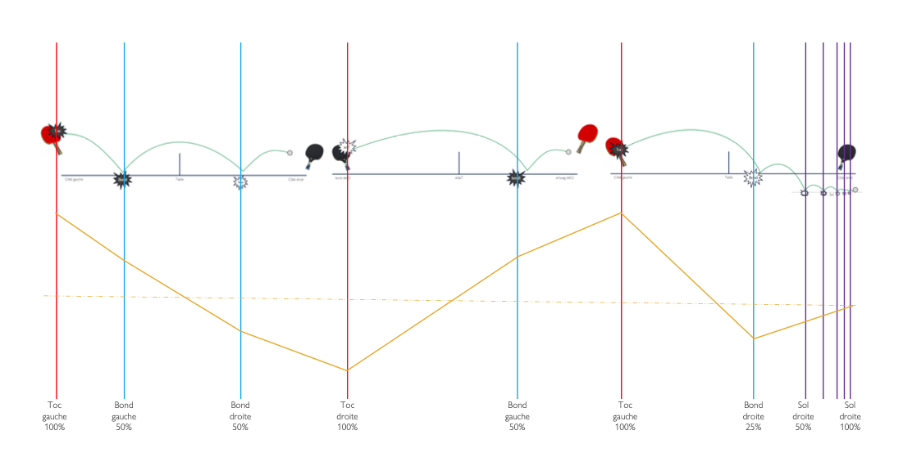
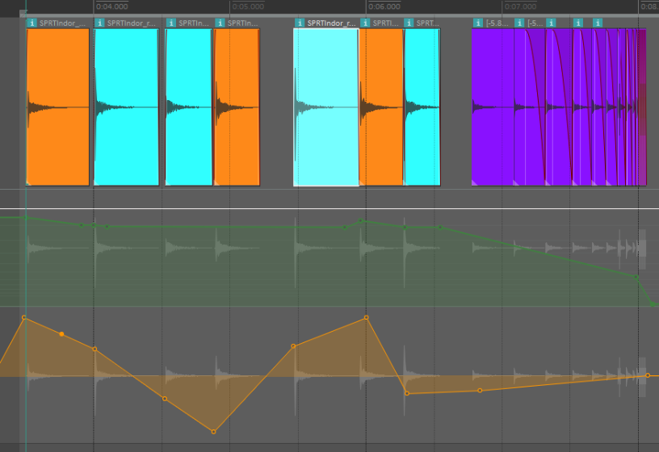

# Motif de ping-Pong

{data-zoom-image}<small>Source: Thomas Ouellet Fredericks</small>

{data-zoom-image}<small>Source: Thomas Ouellet Fredericks</small>

{data-zoom-image}<small>Source: Thomas Ouellet Fredericks</small>

## 3 SONS
- Choisir au moins trois sons différents :
  - un son pour le « toc »
  - un son pour le « bond »
  - un son pour le « sol »

## ÉCHANGER
- Alterner entre les sons du « toc » et du « bond ».
- Les spatialiser de gauche à droite pour créer un mouvement stéréo.

## CONCLUSION
- Terminer avec une séquence de rebondissements en utilisant les sons du « sol ».