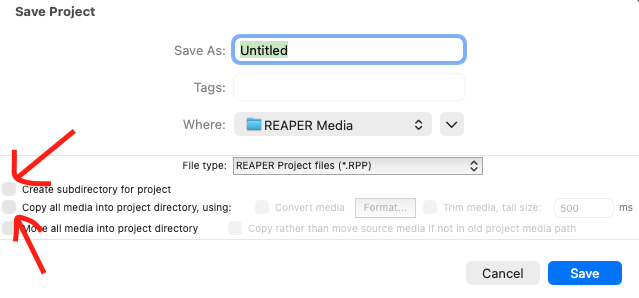
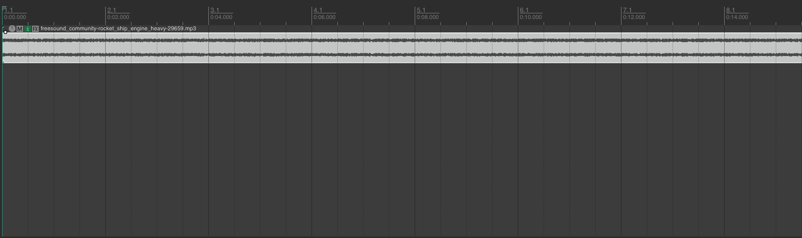

# REAPER

{data-zoom-image}<small>Source: reaper.fm</small>

## 1. Gestion de projet dans Reaper

La gestion de projet est la base de tout travail dans Reaper. Un projet contient **toutes les informations de votre session** : pistes, audio, effets, automatisations, tempo et structure.


### Créer un projet

Lorsque Reaper s’ouvre, un projet vide est généralement déjà créé.

#### ➤ Nouveau projet
- Menu : `File > New Project`
- Raccourci :
  - Windows : `Ctrl + N`
  - Mac : `Cmd + N`

➡️ Permet de repartir d’une session vide.


### Enregistrer un projet

Il est essentiel de sauvegarder dès le début.

#### ➤ Sauvegarde initiale
- Menu : `File > Save Project As`
- Choisir un dossier
- Donner un nom clair au projet

### Exemple de nom :
- Projet_Sonore_01


## Options importantes à l’enregistrement

{data-zoom-image}

### Create subdirectory for project
✔ Recommandé

Crée automatiquement un dossier dédié au projet :
```
Projet/
├── Projet.rpp
├── Audio/
└── autres fichiers
```


---

### Copy all media into project directory
✔ Très recommandé

- Copie tous les fichiers audio dans le dossier du projet
- Évite les erreurs de fichiers manquants

➡️ Sans cette option : les fichiers doivent rester à leur emplacement original.


## Sauvegarder en continu

### Raccourci :
- Windows : `Ctrl + S`
- Mac : `Cmd + S`

➡️ Sauvegarde les modifications du projet.


## Ouvrir un projet

### Méthode :
- `File > Open Project`
- Sélectionner un fichier `.rpp`

### Exemple :
- MonProjet.rpp


## Comprendre le fichier .RPP

Le fichier Reaper est un fichier :

- .rpp


### Il contient :
- la position des clips audio
- les pistes
- les effets
- les automatisations
- la structure du projet

### Il ne contient PAS l’audio lui-même (sauf si copié dans le dossier du projet)


## Structure d’un projet Reaper

### Exemple d’organisation :
```
Projet_Sonore/
├── Projet_Sonore.rpp
├── Audio/
│ ├── voix.wav
│ ├── ambiance.wav
│ └── effets.wav
├── Exports/
│ ├── mix_final.mp3
│ └── mix_final.wav
└── Docs/
└── notes.txt
```

## La timeline
{data-zoom-image}

Représente le temps du projet 


➡️ Les clips audio sont placés sur cette ligne.


## Les items (clips audio)

Dans Reaper, un clip audio = **Item**

### Actions possibles :
- déplacer
- couper
- copier
- coller
- étirer
- ajouter des fondus


## Contrôles des pistes

Chaque piste possède :

- Volume
- Panoramique (gauche/droite)
- Mute
- Solo
- Armement d’enregistrement

## Le mixeur

{data-zoom-image}

- Affichage : `Ctrl + M`
- Permet de voir toutes les pistes en version console


## Le Master

Toutes les pistes passent par le Master :

- Voix
- Musique
- Ambiance

↓
MASTER

↓
Export final


## Bonnes pratiques

### ✔ Nommer les pistes correctement
Mauvais :

- Track 1
- Track 2

Bon :

- Voix
- Musique
- Ambiance


### ✔ Sauvegarder souvent
- `Ctrl + S` / `Cmd + S`


### ✔ Organiser les fichiers
Toujours garder :

- .rpp
- audio
- exports

dans le même dossier.


## Résumé

À retenir :

- Créer un projet
- Enregistrer correctement
- Ouvrir un projet
- Comprendre le fichier `.rpp`
- Organiser les dossiers
- Comprendre pistes, items et timeline
- Sauvegarder efficacement