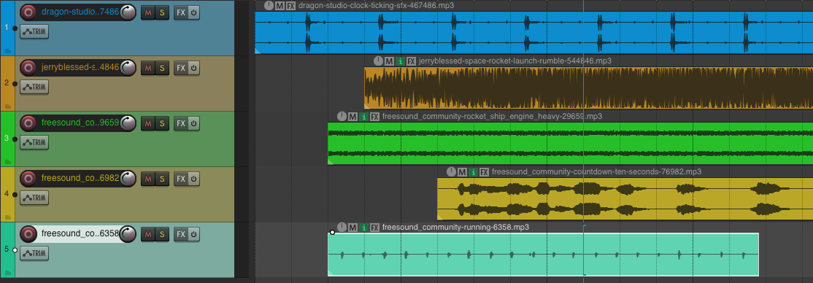

# REAPER

{data-zoom-image}<small>Source: reaper.fm</small>

## 2. Importation et organisation dans Reaper

L’importation et l’organisation sont des étapes essentielles pour garder un projet clair, efficace et facile à travailler. Un projet bien organisé permet de gagner du temps en montage et d’éviter les erreurs.


## Importer des fichiers audio

### ➤ Méthode 1 : Glisser-déposer (la plus simple)
- Ouvrir le dossier contenant les fichiers audio
- Glisser les fichiers directement dans la fenêtre de Reaper
- Les fichiers apparaissent automatiquement comme **items sur des pistes**


### ➤ Méthode 2 : Menu importation
- Menu : `Insert > Media File...`
- Sélectionner le fichier audio
- Cliquer sur **Open**


### Résultat
Chaque fichier importé devient un **item audio** placé sur une piste.


### Bonnes pratiques
- Importer des fichiers organisés dans un dossier clair
- Éviter les fichiers du bureau ou téléchargements
- Toujours travailler avec une structure de projet propre


## Organiser les pistes

Une bonne organisation est essentielle pour les projets audio complexes.


### ➤ Création de pistes
- Menu : `Track > Insert New Track`
- Raccourci :
  - `Ctrl + T` (Windows)
  - `Cmd + T` (Mac)


### Structure recommandée
- Piste 1 : Voix principale
- Piste 2 : Musique
- Piste 3 : Ambiances
- Piste 4 : Effets sonores


### ➤ Organisation logique
- Regrouper les éléments similaires
- Garder les voix en haut
- Mettre les effets en bas


### Utiliser des dossiers de pistes (Folder tracks)
Reaper permet de regrouper des pistes :

#### Exemple :
```
VOIX (folder)
├── Voix 1
├── Voix 2
└── Voix 3
```


➡️ Avantages :

- Volume global contrôlable
- Projet plus clair
- Meilleure gestion du mix


## Renommer les pistes

### ➤ Pourquoi renommer ?
- Éviter la confusion
- Faciliter le montage
- Accélérer le mixage


### ➤ Méthode
- Double-cliquer sur le nom de la piste
- Entrer un nouveau nom


### Exemples :
Mauvais :

- Track 1
- Track 2
- Track 3

Bon :

- Voix
- Musique
- Ambiance


## Colorer les pistes
{data-zoom-image}

Les couleurs permettent une identification visuelle rapide.


### ➤ Méthode 1 : clic droit
- Clic droit sur la piste
- `Track Color`
- Choisir une couleur


### ➤ Méthode 2 : barre de couleur
- Utiliser le sélecteur de couleur dans l’inspector


### Exemple d’organisation couleur

| Type | Couleur |
|------|--------|
| Voix | Bleu |
| Musique | Vert |
| Ambiance | Orange |
| Effets | Rouge |


### Avantages
- Lecture visuelle rapide
- Moins d’erreurs de montage
- Projet plus professionnel


👉 Une bonne organisation est essentielle pour travailler efficacement en montage et en mixage dans Reaper.