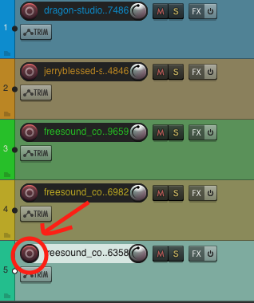
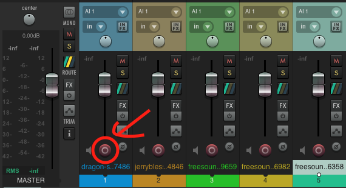
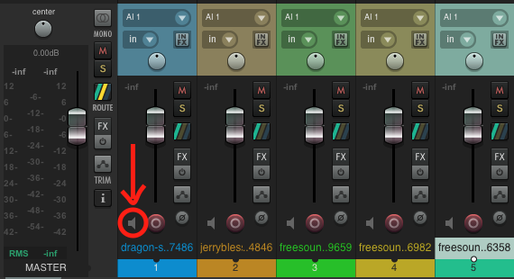

# REAPER

{data-zoom-image}<small>Source: reaper.fm</small>

# 3. Enregistrement dans Reaper

L’enregistrement est une étape centrale dans Reaper. Il permet de capturer des sources audio (voix, instruments, ambiance) en temps réel. Pour bien enregistrer, il faut comprendre la création de piste, le choix des entrées audio et les réglages de monitoring.


## Créer une piste

Avant d’enregistrer, il faut créer une piste.

### ➤ Méthode
- Menu : `Track > Insert New Track`
- Raccourci :
  - Windows : `Ctrl + T`
  - Mac : `Cmd + T`


### Résultat
Une nouvelle piste apparaît dans la session.

Exemple :

- Piste 1 : Audio 1


## Choisir une entrée audio

Chaque piste doit recevoir un signal audio provenant d’une source (micro, interface audio, instrument).


### ➤ Étapes
1. Clique sur la piste
2. Dans le panneau de la piste, clique sur **Input**
3. Choisis une entrée :
   - Mono : `Input 1` ou `Input 2`
   - Stéréo : `Input 1/2`


### Exemple

- Input: Mono > Input 1 (Micro)


### Important
- L’entrée dépend de ton interface audio
- Vérifie toujours que le micro est bien branché


## Armer une piste pour l’enregistrement

“Armer” une piste signifie la préparer à enregistrer.


### ➤ Étapes
- Clique sur le bouton rouge **Record Arm** sur la piste

{data-zoom-image}
{data-zoom-image}


### Résultat
- La piste est prête à recevoir le signal audio
- Le niveau d’entrée peut être visible dans le vu-mètre


### Attention
Si la piste n’est pas armée :
- Aucun son ne sera enregistré


## Activer le monitoring

Le monitoring permet d’entendre le son en direct.

{data-zoom-image}

### ➤ Activation
- Clique sur le bouton **speaker / monitoring** sur la piste
- Ou active dans les options de la piste


### Types de monitoring
- OFF : aucun retour audio
- ON : écoute en direct
- AUTO : écoute seulement pendant l’enregistrement


### Utilité
- Entendre sa voix pendant l’enregistrement
- Ajuster le positionnement du micro
- Vérifier les niveaux


## Enregistrer de l’audio

Une fois tout configuré, tu peux enregistrer.


### ➤ Étapes
1. Armer la piste
2. Vérifier l’entrée audio
3. Activer le monitoring (si nécessaire)
4. Placer le curseur au début
5. Appuyer sur **Record**


### Raccourcis
- Enregistrer : `Ctrl + R` (Windows) / `Cmd + R` (Mac)
- Stop : `Space`


### Résultat
Un nouvel item audio apparaît sur la piste :

```
|------ Enregistrement.wav ------|
```


## Vérification des niveaux

Pendant l’enregistrement :
- Le signal ne doit pas être trop faible (bruit)
- Ni trop fort (distorsion)


### Bon niveau recommandé
- Zones vertes : OK
- Zones jaunes : fort mais acceptable
- Rouge : saturation (à éviter)


👉 Ces étapes sont essentielles pour enregistrer proprement une voix, un instrument ou une ambiance dans Reaper.