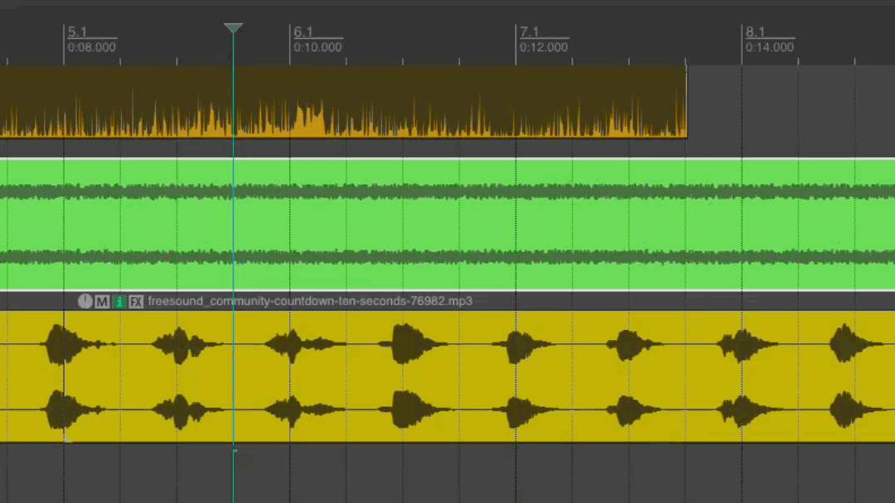
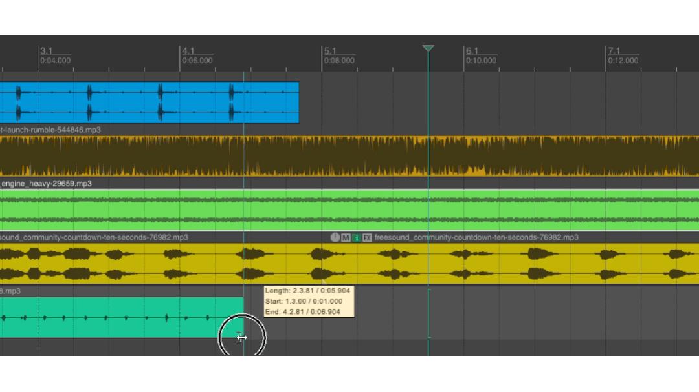
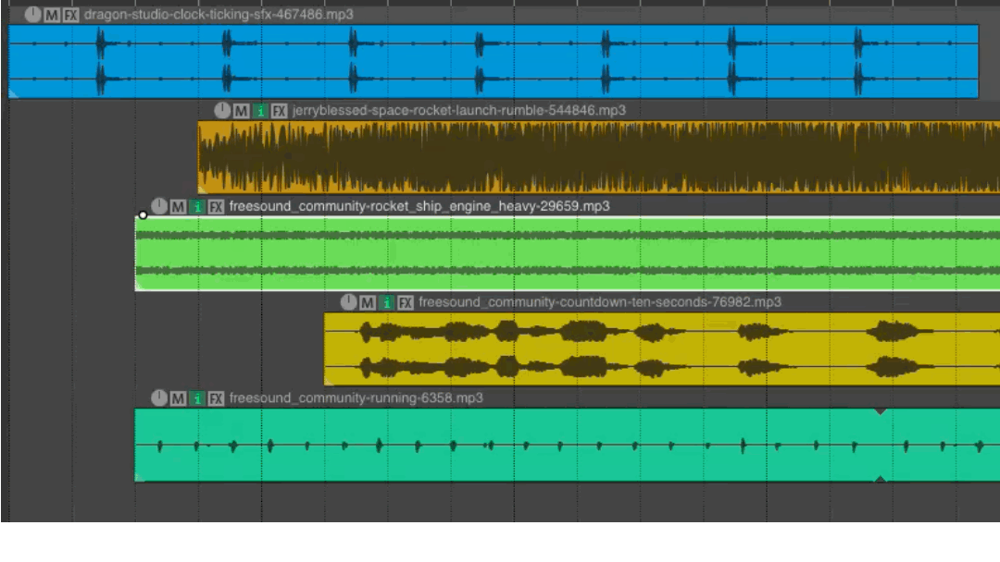
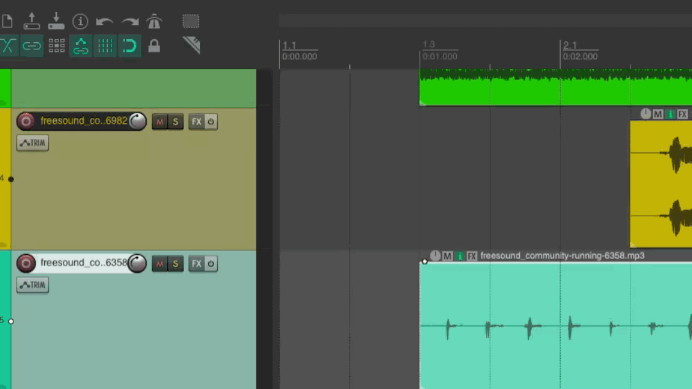

# REAPER
{data-zoom-image}<small>Source: reaper.fm</small>

# 4. Édition audio dans Reaper

L’édition audio dans Reaper permet de manipuler les enregistrements pour construire un montage propre, précis et fluide. Ces outils sont essentiels pour organiser, nettoyer et structurer un projet sonore.

## Sélectionner et déplacer des clips

Dans Reaper, un clip audio est appelé un **Item**.

### ➤ Sélectionner un clip
- Cliquer simplement sur l’item
- Il devient surligné

### ➤ Déplacer un clip
- Cliquer et glisser l’item
- Déplacer horizontalement = changer le temps
- Déplacer verticalement = changer de piste

## Couper (Split)

{data-zoom-image}

Le Split permet de diviser un clip audio en plusieurs parties.

### ➤ Méthode
- Placer le curseur à l’endroit souhaité
- Appuyer sur :
  - `S` (raccourci principal)

### Utilité
- Enlever des erreurs
- Réorganiser des sections
- Créer des effets de montage

## Supprimer

### ➤ Méthode
- Sélectionner l’item
- Appuyer sur `Delete`

### Résultat
Le clip est retiré de la timeline.

### Astuce
- Utiliser `Ctrl + Z` pour annuler une suppression

## Copier et coller

Permet de dupliquer des clips audio.

### ➤ Copier
- `Ctrl + C` / `Cmd + C`

### ➤ Coller
- `Ctrl + V` / `Cmd + V`

## Rogner (Trim)

{data-zoom-image}

Le trim permet de raccourcir ou allonger un clip sans le couper.

### ➤ Méthode
- Placer la souris sur le bord du clip
- Glisser vers l’intérieur ou l’extérieur

### Résultat
- Ajustement précis du début ou de la fin

### Utilité
- Enlever les silences
- Ajuster une prise de son
- Nettoyer un montage

## Fondus (Fade In / Fade Out)

{data-zoom-image}

Les fondus permettent des transitions douces.

### ➤ Fade In
- Apparition progressive du son

### ➤ Fade Out
- Disparition progressive du son

### ➤ Méthode
- Passer la souris dans le coin supérieur du clip
- Glisser pour créer un fondu

### Utilité
- Éviter les clics audio
- Créer des transitions naturelles
- Améliorer la fluidité du montage

## Snap (magnétisme à la grille)

{data-zoom-image}

Le Snap permet d’aligner automatiquement les clips sur la grille temporelle.

### ➤ Activation
- Bouton **Snap** dans la barre d’outils
- Ou touche `Alt + S` (selon configuration)

### Fonctionnement
- Les clips “s’accrochent” au temps (beats, mesures)

### Exemple
- Sans Snap : clips légèrement décalés
- Avec Snap : clips parfaitement alignés

### Utilité
- Synchronisation précise
- Travail rythmique (musique, podcast)
- Éviter les décalages involontaires

👉 Ces outils constituent la base du montage audio professionnel dans Reaper.