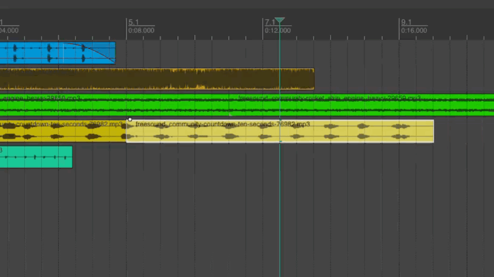
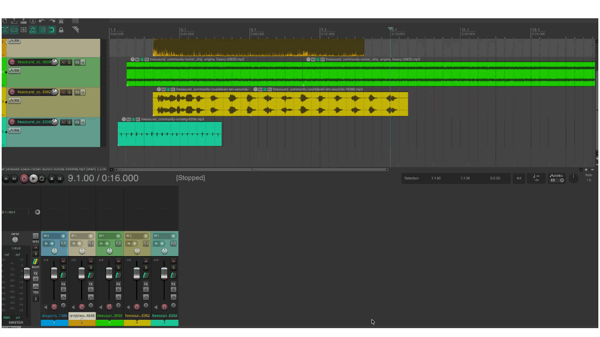

# REAPER
{data-zoom-image}<small>Source: reaper.fm</small>

# Navigation dans Reaper

La navigation permet de se déplacer efficacement dans le projet, de zoomer sur les détails et de contrôler la lecture audio. Une bonne maîtrise de ces outils est essentielle pour travailler rapidement et précisément.

## Zoom horizontal et vertical

Le zoom permet d’agrandir ou de réduire la vue du projet.

---

### ➤ Zoom horizontal (temps)

{data-zoom-image}

Permet de voir plus ou moins de temps sur la timeline.

#### Méthodes :
- Molette de la souris + `Ctrl` (Windows) / `Cmd` (Mac)
- Glisser dans la barre de zoom en bas de la timeline
- Utiliser les raccourcis zoom

#### Exemple :

- Zoom large : vue globale du projet
- Zoom serré : précision sur quelques secondes

### ➤ Zoom vertical (hauteur des pistes)
{data-zoom-image}

Permet d’agrandir ou réduire la taille des pistes.

#### Méthodes :
- Molette + `Shift`
- Glisser sur la zone des pistes
- Ajustement manuel des pistes

#### Exemple :
- Zoom vertical élevé → pistes faciles à éditer
- Zoom vertical réduit → plus de pistes visibles

## Déplacement dans la timeline

La timeline représente le temps du projet.

### ➤ Méthodes de déplacement

- Cliquer et glisser dans la règle temporelle
- Utiliser la barre de défilement horizontale
- Molette + `Alt` (selon configuration)

### Résultat
Permet de naviguer rapidement dans le projet sans déplacer les clips.

### Utilité
- Se déplacer entre les sections
- Accéder rapidement à une partie précise
- Travailler sur des projets longs

## Utilisation du curseur de lecture

Le curseur de lecture (playhead) indique la position actuelle dans le temps.

### ➤ Déplacement du curseur
- Cliquer dans la timeline
- Appuyer sur lecture (`Space`)
- Cliquer directement sur la règle temporelle

### Utilité
- Définir le point de départ de lecture
- Tester un montage
- Positionner des coupes ou effets

## Boucle (Loop)

{data-zoom-image}

La boucle permet de répéter une section en continu.

### ➤ Activer la boucle
- Cliquer sur le bouton **Loop**
- Raccourci : `Ctrl + L` (peut varier selon configuration)

### ➤ Définir une zone de loop
- Sélectionner une portion de la timeline
- Activer la boucle → la sélection devient une répétition

### Utilité
- Travailler une section musicale
- Répéter une prise pour édition
- Tester un mix sur une boucle

👉 Ces fonctions sont essentielles pour travailler rapidement et avec précision dans Reaper.