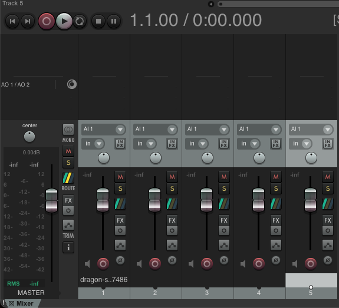
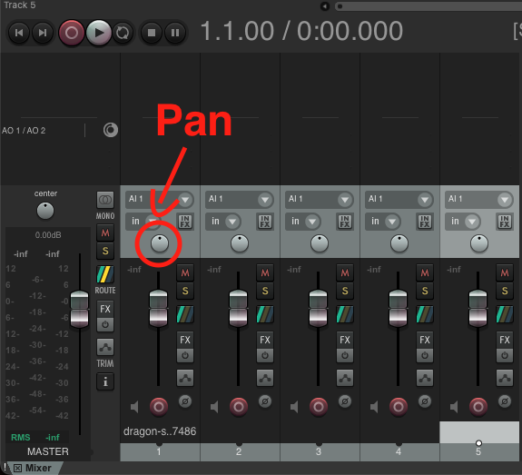
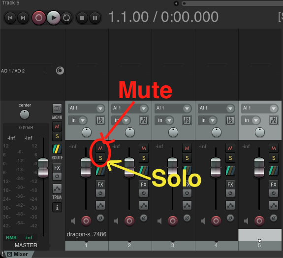

# REAPER
{data-zoom-image}<small>Source: reaper.fm</small>

# Mixage de base dans Reaper

Le mixage de base consiste à équilibrer les différents éléments audio d’un projet (voix, musique, effets) afin d’obtenir un rendu clair, cohérent et agréable à écouter. Dans Reaper, cela passe principalement par le contrôle du volume, du panoramique, du mute/solo et du suivi des niveaux.

## Ajuster le volume d’une piste

Le volume d’une piste contrôle son niveau sonore global dans le mix.

### ➤ Méthode
- Utiliser le **fader de volume** dans le panneau de la piste (à gauche)
- Glisser vers le haut ou le bas

### Résultat
- Vers le haut → son plus fort
- Vers le bas → son plus faible

### Bonnes pratiques
- Éviter de pousser le volume trop haut (risque de saturation)
- Ajuster les pistes entre elles plutôt que de tout augmenter

### 📊 Exemple
- Voix : -6 dB
- Musique : -12 dB
- Effets : -10 dB

## Ajuster le panoramique (Pan)
{data-zoom-image}

Le panoramique permet de placer un son dans l’espace stéréo (gauche / droite).

### ➤ Méthode
- Utiliser le contrôle **Pan** sur la piste
- Glisser vers :
  - Gauche (L)
  - Droite (R)
  - Centre

### Exemple

- Voix → Centre
- Guitare → Légèrement gauche
- Piano → Légèrement droite

### Utilité
- Créer une image sonore réaliste
- Éviter la surcharge au centre
- Donner de la largeur au mix

## Utiliser le Mute et le Solo
{data-zoom-image}

Ces deux fonctions permettent de contrôler quelles pistes sont entendues.

### Mute (M)

- Coupe complètement le son d’une piste
- La piste reste visible mais silencieuse

#### ➤ Utilité :
- Tester un mix sans une piste
- Comparer des versions

### Solo (S)

- Coupe toutes les autres pistes sauf celle sélectionnée

#### ➤ Utilité :
- Travailler une piste isolée
- Vérifier un enregistrement ou un effet

### Exemple
- Solo VOIX → on n’entend que la voix
- Mute MUSIQUE → la musique disparaît du mix

## Contrôler les niveaux dans le mixer

Le mixer permet de visualiser et ajuster toutes les pistes en même temps.

### ➤ Ouvrir le mixer
- Menu : `View > Mixer`
- Raccourci :
  - Windows : `Ctrl + M`
  - Mac : `Cmd + M`

### Ce qu’on y voit
- Toutes les pistes du projet
- Les faders de volume
- Les panoramiques
- Le niveau du Master

### Les vumètres (meters)

Les vumètres indiquent le niveau sonore en temps réel.

#### Couleurs :
- 🟢 Vert : niveau correct
- 🟡 Jaune : fort mais acceptable
- 🔴 Rouge : saturation (à éviter)

### Bon niveau recommandé
- Voix : autour de -6 dB à -12 dB
- Mix global : ne doit jamais dépasser 0 dB

### Attention à la saturation
- Si le signal est trop fort → distorsion
- Toujours garder une marge de sécurité (headroom) **(-0.2 db)**

👉 Ces outils constituent la base du mixage audio dans Reaper et permettent de créer un son clair et professionnel.