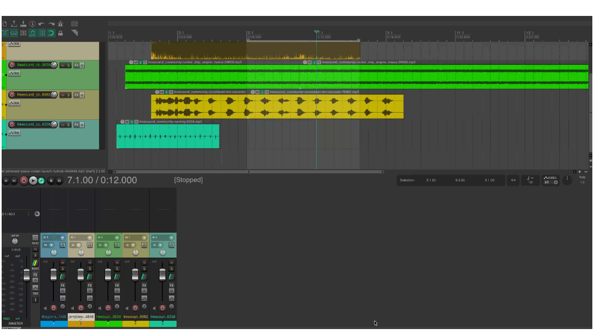
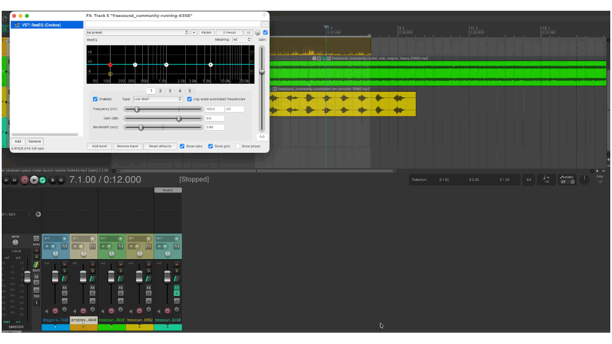

# REAPER
{data-zoom-image}<small>Source: reaper.fm</small>

# Effets audio dans Reaper (FX)

Les effets audio (FX) permettent de transformer, améliorer ou corriger un son. Dans Reaper, ils sont appliqués directement sur les pistes et peuvent modifier le timbre, la dynamique, l’espace ou la clarté d’un enregistrement.


## Ajouter un effet (FX)
{data-zoom-image}

Chaque piste dans Reaper peut contenir une chaîne d’effets.


### ➤ Méthode
1. Clique sur le bouton **FX** de la piste
2. La fenêtre “FX Browser” s’ouvre
3. Choisis un effet dans la liste
4. Double-clique pour l’ajouter à la piste


### Types d’effets courants
- EQ (égalisation)
- Compression
- Reverb (réverbération)
- Delay (écho)
- Distortion
- Noise gate


### Exemple
- Voix → EQ + Compression + Reverb légère
- Musique → EQ + Compression douce


## Activer ou désactiver un effet
{data-zoom-image}

Chaque effet peut être activé ou désactivé sans être supprimé.


### ➤ Méthode
Dans la fenêtre FX :
- Cliquer sur le bouton **bypass**
- Ou décocher l’effet dans la chaîne


### Résultat
- Effet activé → le son est modifié
- Effet désactivé → son original (dry)


### Utilité
- Comparer avant/après
- Tester différents réglages
- Éviter de supprimer un effet par erreur


### Exemple
- FX ON → voix plus claire / plus large
- FX OFF → voix naturelle brute


## Comprendre l’ordre des effets

L’ordre des effets est très important car ils s’appliquent **les uns après les autres**.


### ➤ Chaîne d’effets
Les effets fonctionnent comme une chaîne :

```
Audio brut
↓
EQ
↓
Compression
↓
Reverb
↓
Sortie finale
```


### Pourquoi l’ordre est important ?

Chaque effet modifie le signal pour le suivant.

### 📌 Exemple concret

#### ❌ Mauvais ordre

```
Reverb → Compression → EQ
```
➡️ Résultat : son flou, compression sur la réverbération


#### ✅ Bon ordre
```
EQ → Compression → Reverb
```

➡️ Résultat : son propre, contrôlé et naturel


## Rôle des effets principaux

### EQ (Equalizer)
- Coupe ou augmente certaines fréquences
- Nettoie le son


### Compression
- Réduit les écarts de volume
- Rend le son plus stable


### Reverb
- Ajoute de l’espace
- Simule une pièce ou un environnement


### Delay
- Crée des répétitions du son
- Effet d’écho


## Bonnes pratiques

- Ajouter les effets progressivement
- Toujours comparer avec et sans FX
- Éviter d’empiler trop d’effets
- Garder un son naturel (surtout pour la voix)


👉 Les effets audio sont essentiels pour transformer un enregistrement brut en un son professionnel dans Reaper.