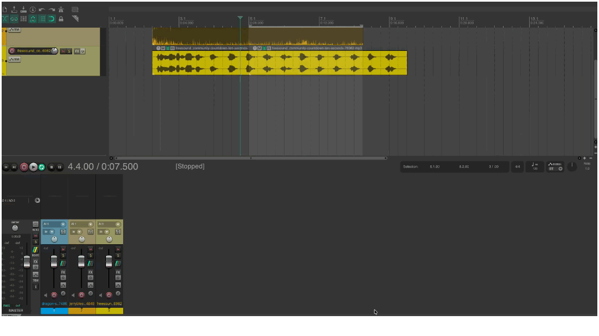
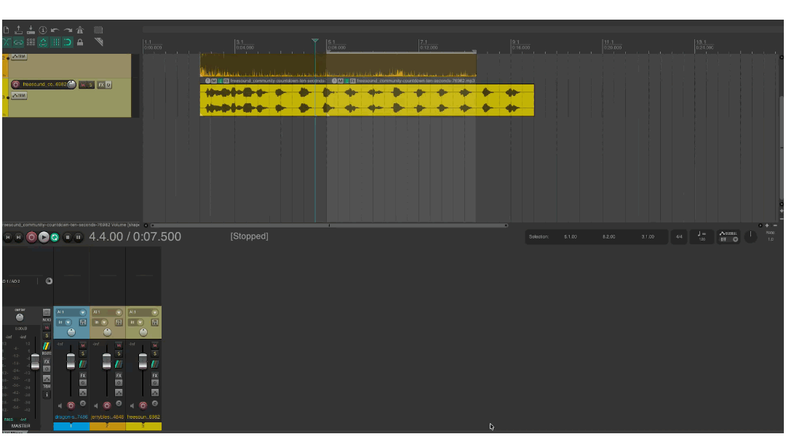
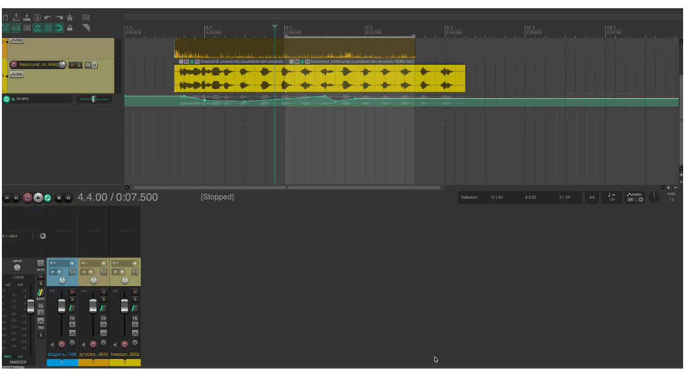

# REAPER
{data-zoom-image}<small>Source: reaper.fm</small>

# Automatisation dans Reaper

L’automatisation permet de faire varier des paramètres dans le temps (volume, panoramique, effets, etc.). Au lieu de tout régler manuellement en continu, on “programme” des changements précis sur la timeline.

## Créer une enveloppe de volume
{data-zoom-image}
Une enveloppe de volume permet de modifier le niveau sonore d’une piste à différents moments.

### ➤ Méthode
1. Clique sur la piste
2. Clique sur le bouton **Trim / Envelopes** (ou clic droit sur la piste)
3. Active **Volume**
4. Une ligne apparaît sur la piste (l’enveloppe)

### ➤ Ajouter des points
- Double-cliquer sur la ligne pour ajouter un point
- Déplacer les points vers le haut ou le bas

➡️ Le volume change progressivement dans le temps

### Utilité
- Baisser la musique sous la voix
- Créer des montées ou descentes de volume
- Faire des fondus avancés

## Créer une enveloppe de panoramique
{data-zoom-image}

L’enveloppe de panoramique permet de déplacer un son dans l’espace stéréo (gauche ↔ droite) au fil du temps.

### ➤ Méthode
1. Clique sur la piste
2. Active **Pan envelope**
3. Une ligne apparaît
4. Ajoute des points et déplace-les

### Utilité
- Créer du mouvement dans le mix
- Simuler un déplacement (voiture, passage, etc.)
- Rendre un mix plus vivant

## Modifier les points d’automatisation
{data-zoom-image}
Les points (nodes) contrôlent la forme de l’automatisation.

### ➤ Actions possibles
- Cliquer et déplacer un point
- Ajouter un point (double-clic sur la ligne)
- Supprimer un point (sélection + Delete)
- Ajuster la courbe (drag vertical/horizontal)

### Types de mouvements
- Linéaire (direct)
- Progressif (fondu)
- Saccadé (changement rapide)

## Applications concrètes

### Voix + musique
- Musique baisse automatiquement quand la voix entre
- Puis remonte quand la voix s’arrête

### Effet sonore
- Objet qui traverse le champ stéréo
- Exemple : avion qui passe de gauche à droite

### Mix dynamique
- Variations de volume pour éviter la monotonie
- Accentuation de moments importants

## Bonnes pratiques

- Ne pas surcharger l’automatisation
- Utiliser des transitions douces
- Toujours écouter le résultat en contexte
- Vérifier que les changements restent naturels

👉 L’automatisation permet de rendre un mix vivant, dynamique et professionnel dans Reaper.