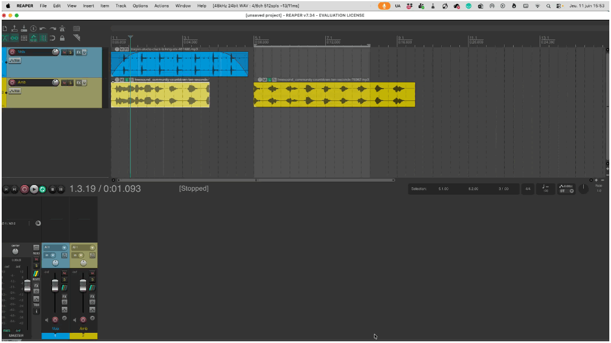

# REAPER
{data-zoom-image}<small>Source: reaper.fm</small>

# Routage de base dans Reaper

Le routage (routing) permet de contrôler **où va le signal audio** dans un projet. Au lieu d’envoyer chaque piste directement au master, on peut créer des chemins vers d’autres pistes pour appliquer des effets ou organiser le mix.


## Comprendre les Sends

Un **send** est une copie du signal d’une piste envoyée vers une autre piste.


### ➤ Principe
- La piste originale continue de jouer normalement
- Une copie du son est envoyée vers une autre piste

### Schéma simple
```
Voix ─────► Master
└──────► Reverb (send)
```


### Utilité des sends
- Ajouter une reverb partagée
- Créer un delay commun
- Gagner en contrôle et en efficacité
- Éviter de mettre les mêmes effets sur plusieurs pistes


### ➤ Créer un send dans Reaper
1. Clique sur le bouton **Route** de la piste
2. Dans la section “Sends”
3. Clique sur **Add new send**
4. Choisis la piste cible


## Créer une piste d’effet auxiliaire (reverb commune)
{data-zoom-image}

Une piste auxiliaire (ou **FX bus**) est une piste dédiée aux effets.


### ➤ Exemple : Reverb commune

#### Étape 1 : créer une piste FX
- `Track > Insert New Track`
- Nom : `Reverb`


#### Étape 2 : ajouter un effet
- Clique sur **FX**
- Ajoute une **Reverb**


#### Étape 3 : transformer la piste en “effet”
- Met le volume du signal direct à 0% (wet uniquement)
- La piste ne joue que l’effet


#### Étape 4 : envoyer des pistes vers la reverb
- Sur les pistes (voix, musique, etc.)
- Ajouter un **send vers la piste Reverb**


### Schéma
```
Voix ─────► Master
└──────► Reverb FX ─────► Master
Musique ───► Master
└──────► Reverb FX ─────► Master
```


### Avantages
- Une seule reverb pour plusieurs pistes
- Contrôle global de l’espace sonore
- Gain en performance (moins d’effets lourds)


## Comprendre le Master Bus

Le **Master Bus** est la sortie finale de tout le projet.


### ➤ Fonctionnement
Toutes les pistes sont automatiquement envoyées au Master :

```
Piste 1 ─┐
Piste 2 ─┼──► MASTER ───► Sortie audio
Piste 3 ─┘
```


### Rôle du Master
- Mélanger toutes les pistes
- Contrôler le volume global
- Appliquer des effets finaux (EQ, limiter, compression)


### Important
- Le Master ne doit jamais saturer
- Garder une marge (headroom), idéalement autour de -6 dB

### ➤ Effets sur le Master
On peut ajouter des effets globaux :

- EQ final
- Limiteur (évite la distorsion)
- Compression légère

👉 Le routage permet de construire un mix plus professionnel, flexible et organisé dans Reaper.