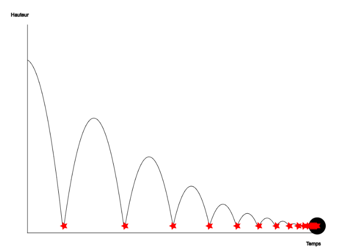
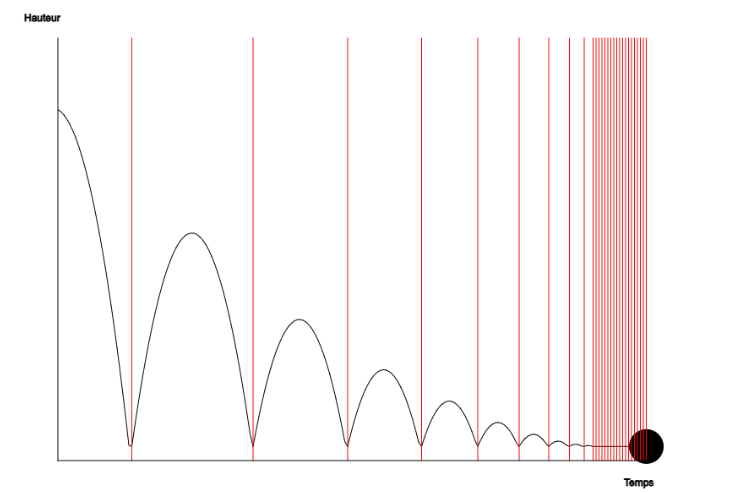
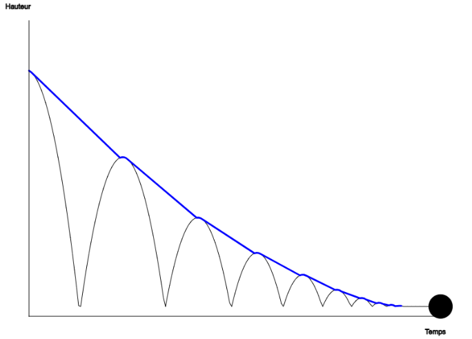
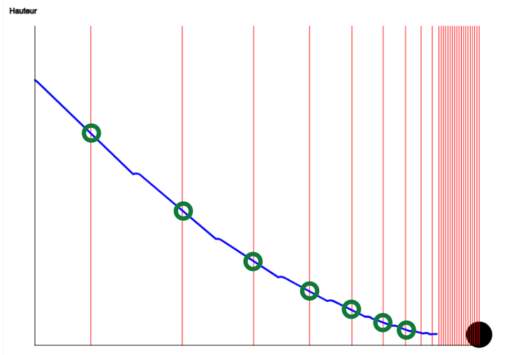
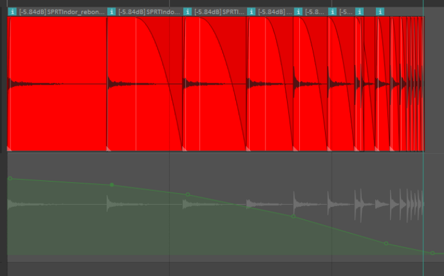

# Motif de rebondissement

{data-zoom-image}

<small>Source: Thomas Ouellet Fredericks</small>
{data-zoom-image}<small>Source: Thomas Ouellet Fredericks</small>
{data-zoom-image}<small>Source: Thomas Ouellet Fredericks</small>
{data-zoom-image}<small>Source: Thomas Ouellet Fredericks</small>
{data-zoom-image}<small>Source: Thomas Ouellet Fredericks</small>

## RÉPÉTER
- Rejouer le même son au moins une dizaine de fois.

## RÉDUIRE L’INTERVALLE
- Réduire progressivement le temps entre chaque répétition.
- Les répétitions deviennent de plus en plus rapprochées.

## BAISSER LE VOLUME
- À chaque répétition, diminuer progressivement le niveau sonore.
- Le son devient de moins en moins fort au fil du temps.