# Enregistrement monophonique

### 1. Ouvrir l’appareil 
(ne pas avoir les écouteurs sur la tête).

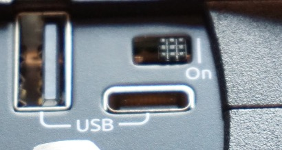{data-zoom-image}

---

### 2. Sélectionner la bonne batterie 
si demandé (“Change Battery Type To L-Mount?”, cliquer “Ok”).

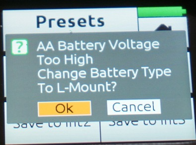{data-zoom-image}

---

### 3. Dans le menu principal, charger (loader) le preset “ENR [Int4]”.

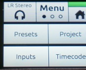{data-zoom-image}
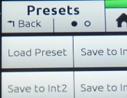{data-zoom-image}
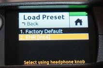{data-zoom-image}

---

### 4. S'assurer que l'enregistrement est en 48khz et 24 bits 
dans le menu "Record".

### 5. Baisser le volume des écouteurs.

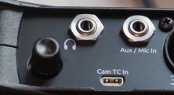{data-zoom-image}
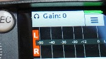{data-zoom-image}

---

### 6. Brancher le fil XLR du micro 
dans l’entrée 1 et brancher le microphone.

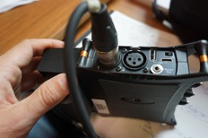{data-zoom-image}

---

### 7. Activer le phantom power (48v) 
si nécessaire (peser sur le gradateur de la piste 1, activer le 48v).

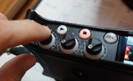{data-zoom-image}
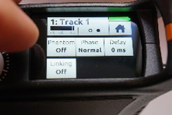{data-zoom-image}
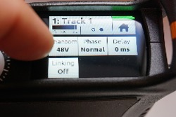{data-zoom-image}  

---

### 8. Micro 1
jusqu'à la valeur désirée.

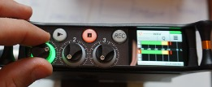{data-zoom-image}   

---

### 9. S'assurer que les pistes 1 et 2 ne sont pas liées
- Appuyer sur le gradateur 1, **“linking”**, **“off”**.

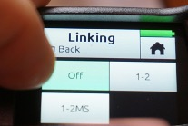{data-zoom-image}  

---

### 10. Brancher les écouteurs. 
Monter tranquillement leur volume jusqu'à une écoute confortable (le son devrait joué dans une seule oreille, l'oreille gauche).

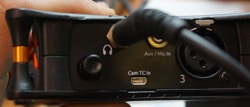{data-zoom-image}  

!!! tip "Tip"

    Pour faire jouer le son dans les deux oreilles, Appuyer sur menu, l’onglet écouteur, **“Preset 1 MONO”**

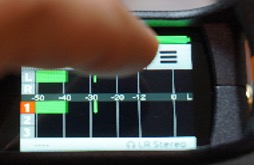{data-zoom-image} 
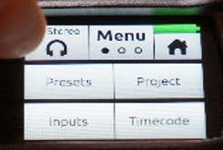{data-zoom-image}  
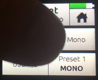{data-zoom-image}  

---

### 11. S’assurer que la piste 1 est armée avant d'enregistrer 
- Appuyer sur le gradateur, activer **"Arm"**. 

{data-zoom-image} 
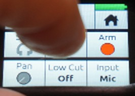{data-zoom-image}  

!!! warning "Important"

    Seules les pistes armées enregistreront.

### 12. Faire un test d'enregistrement 
- Appuyer sur **“REC”**, parler dans le micro, peser sur **“arrêt”** (stop).
### 13. Vérifier si l'enregistrement s'est correctement effectué 
- Appuyer sur “marche” (play).
