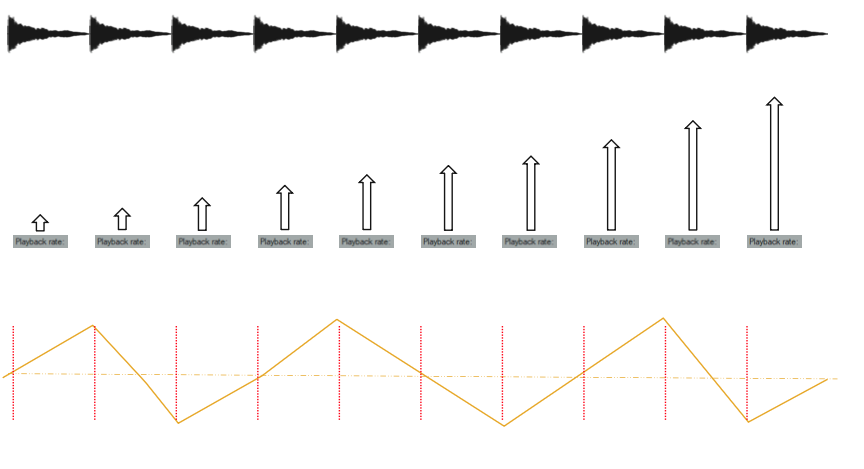
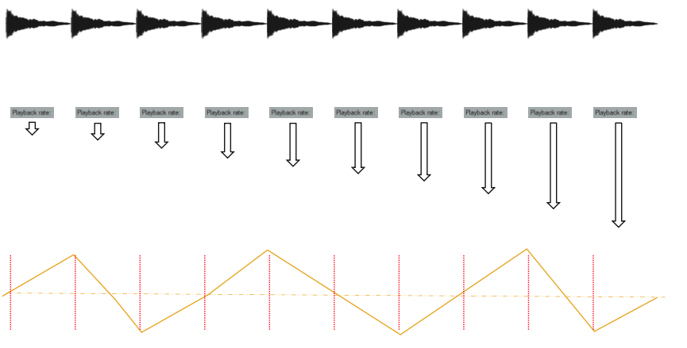

# Motif spirale

## Spirale ascendante

## Spirale ascendante 2

## Spirale ascendante/descendante

## Spirale ascendante/descendante substitution

## Spirale ascendante inverse

## Spirale descendante

{data-zoom-image}<small>Source: Thomas Ouellet Fredericks</small>

{data-zoom-image}<small>Source: Thomas Ouellet Fredericks</small>
{data-zoom-image}<small>Source: Thomas Ouellet Fredericks</small>

### 1. Définition
- Le motif spirale consiste à construire un mouvement sonore évolutif basé sur des répétitions d’un même son.
- Le résultat évoque un dessin de spirale à travers le son et la spatialisation.

## 2. Spirale ascendante
- Répéter le même son plusieurs fois (les intervalles peuvent varier : plus rapides ou plus lents).
- Augmenter progressivement le **Playback Rate** à chaque répétition.
- Faire osciller la spatialisation (**pan**) à chaque répétition :
  - gauche → centre → droite
- Varier l’amplitude et la vitesse de l’oscillation pour enrichir le mouvement.

## 3. Spirale descendante
- Répéter le même son plusieurs fois (intervalles variables possibles).
- Réduire progressivement le **Playback Rate** à chaque répétition.
- Faire osciller la spatialisation (**pan**) à chaque répétition :
  - gauche → centre → droite
- Jouer avec l’amplitude et la vitesse de l’oscillation pour créer un mouvement plus organique.