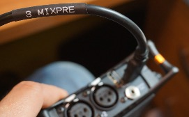
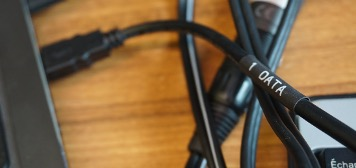
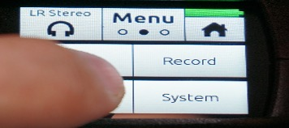
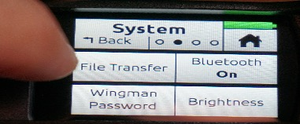
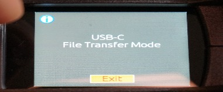

# Transfert des fichiers 

### 1. Brancher le fil USB-C 
dans le Sound Device et l'USB-A **“DATA”** dans l'ordinateur. 

{data-zoom-image} 
{data-zoom-image}  
{data-zoom-image}  

Si le Sound Device vous demande **"Would you run on battery power"**, cliquer **"Yes"**.

---

### 2. Appuyer sur le menu principal, ”System”, “Fil transfer” 
un disque devrait apparaître sur l'ordinateur pour transférer les fichiers sonores.

{data-zoom-image} 
{data-zoom-image}  
{data-zoom-image}  
{data-zoom-image}  