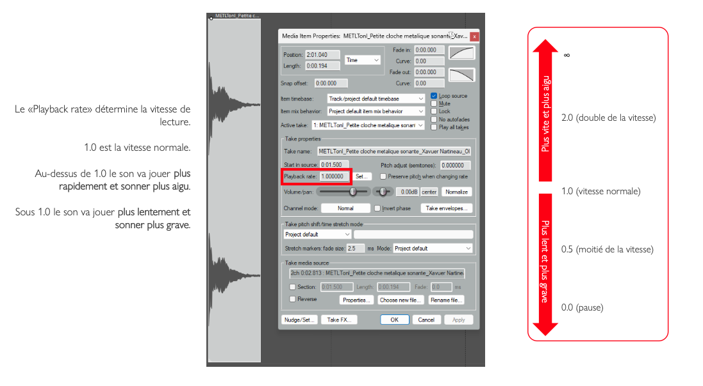
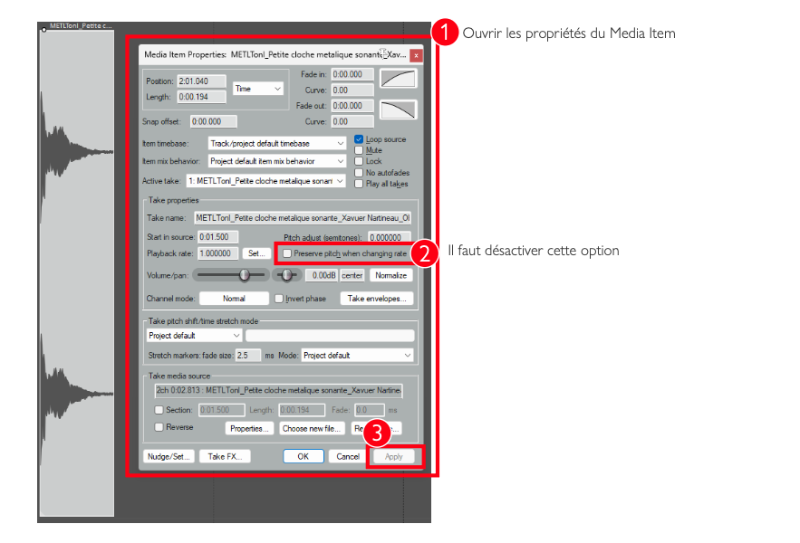

# VITESSE DE LECTURE («PLAYBACK RATE»)

## Vitesse demie

## Vitesse double

{data-zoom-image}<small>Source: Thomas Ouellet Fredericks</small>

{data-zoom-image}<small>Source: Thomas Ouellet Fredericks</small>